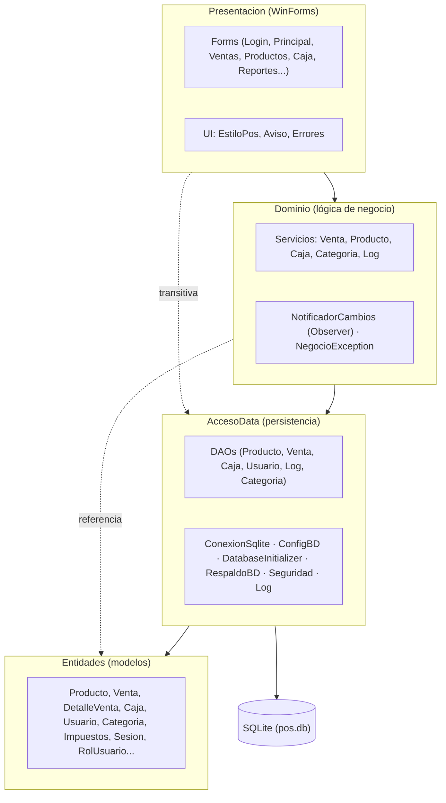
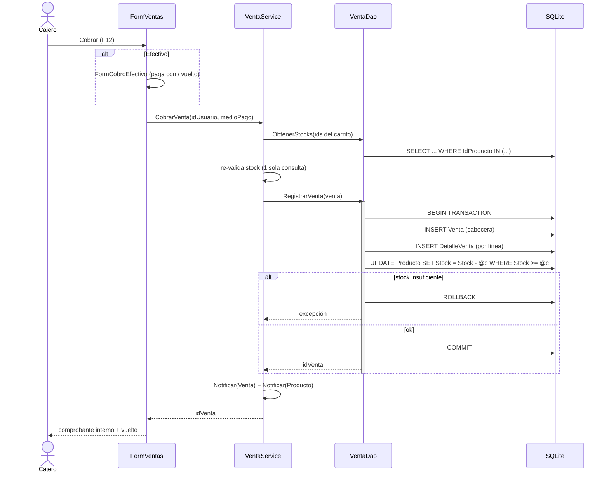
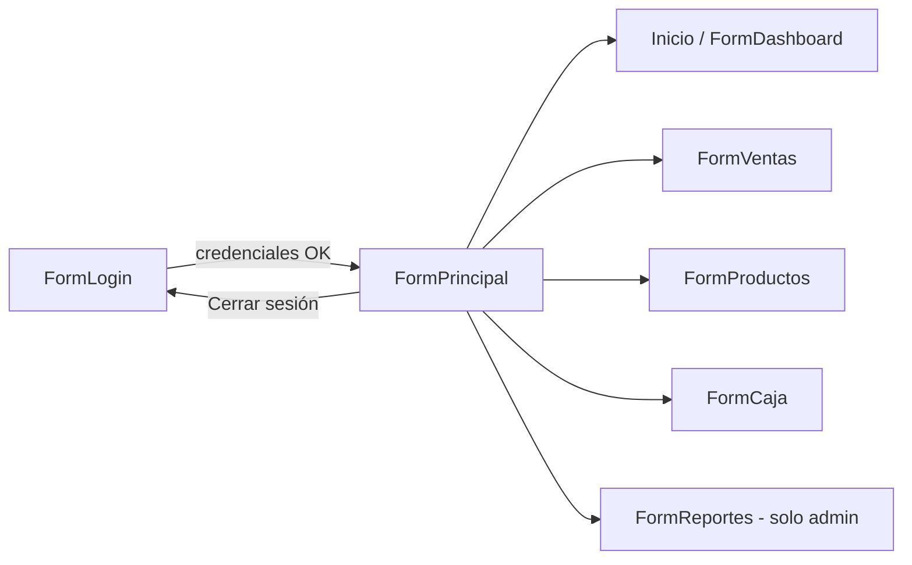
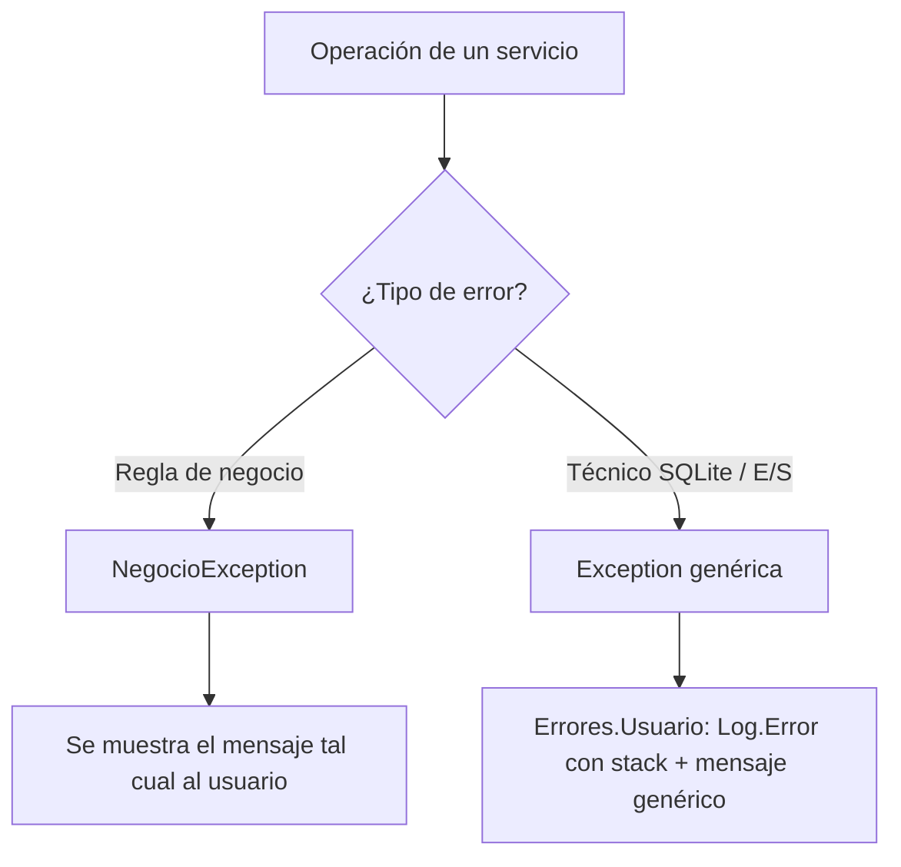

# Documentación técnica — Arquitectura del Sistema

Sistema POS de escritorio para minimarket. Documento para desarrolladores y mantenedores.

## Índice

1. [Visión general](#1-visión-general)
2. [Arquitectura en capas](#2-arquitectura-en-capas)
3. [Estructura de proyectos](#3-estructura-de-proyectos)
4. [Patrones de diseño](#4-patrones-de-diseño)
5. [Flujo de una venta](#5-flujo-de-una-venta)
6. [Navegación entre módulos](#6-navegación-entre-módulos)
7. [Seguridad](#7-seguridad)
8. [Manejo de errores](#8-manejo-de-errores)
9. [Logging y auditoría](#9-logging-y-auditoría)
10. [Notificación de cambios (Observer)](#10-notificación-de-cambios-observer)
11. [Reglas de negocio](#11-reglas-de-negocio)
12. [Rendimiento](#12-rendimiento)
13. [Pruebas](#13-pruebas)
14. [Compilación, ejecución y despliegue](#14-compilación-ejecución-y-despliegue)
15. [Estructura de carpetas](#15-estructura-de-carpetas)

---

## 1. Visión general

| | |
|---|---|
| **Tipo** | Aplicación de escritorio (un solo equipo, sin servidor) |
| **Lenguaje / runtime** | C# · .NET Framework **4.7.2** |
| **UI** | Windows Forms (WinForms) |
| **Base de datos** | **SQLite** (local, una caja) o **SQL Server** (central, varias cajas), elegible por configuración |
| **Pruebas** | xUnit (149 casos: unitarios + integración) |
| **Uso** | Interno (empleados + administrador). No de cara al cliente. |
| **Mercado** | Chile (CLP, IVA 19 % incluido en precios) |

Sin dependencia de internet. La boleta/DTE la emite una máquina aparte; este sistema registra
y controla la venta internamente. Compatible con escáner de código de barras (HID).

---

## 2. Arquitectura en capas

Arquitectura **N-capas** clásica con dependencias en una sola dirección (de arriba hacia
abajo). Cada capa es un proyecto independiente.



**Regla de oro:** la dependencia fluye hacia abajo. `Entidades` no conoce a nadie; `Presentacion`
no habla con la base de datos directamente, siempre pasa por un **Servicio** del `Dominio`.

---

## 3. Estructura de proyectos

| Proyecto | Responsabilidad | Contenido clave |
|---|---|---|
| **Entidades** | Modelos de datos (POCOs) + estado de sesión, sin lógica de negocio | `Producto`, `Venta`, `DetalleVenta`, `VentaEnCurso`, `Caja`, `Usuario`, `Categoria`, `LogMovimiento`, `Impuestos`, `MedioPago`, `RolUsuario`, `EstadoCaja`, `Sesion`, `ResumenVentas`, `ResumenCaja`, `ProductoVendido` |
| **AccesoData** | Acceso a SQLite (DAOs con SQL parametrizado), infraestructura | `DAO/*`, `ConexionSqlite`, `ConfigBD`, `DatabaseInitializer`, `RespaldoBD`, `Seguridad` (PBKDF2), `Log` (a archivo) |
| **Dominio** | Lógica de negocio, validaciones, orquestación | `Servicios/*`, `Eventos/NotificadorCambios`, `NegocioException` |
| **Presentacion** | UI WinForms y estilo | `Forms/*`, `UI/EstiloPos`, `UI/Aviso`, `UI/Errores`, `Program` |
| **PosMaqueta.Tests** | Pruebas automatizadas | xUnit; integración contra BD SQLite temporal |

Referencias entre proyectos: `AccesoData → Entidades`; `Dominio → Entidades, AccesoData`;
`Presentacion → Dominio` (y transitivamente el resto); `Tests → Entidades, AccesoData, Dominio`.

---

## 4. Patrones de diseño

| Patrón | Dónde | Para qué |
|---|---|---|
| **N-capas** | Estructura de proyectos | Separación de responsabilidades |
| **DAO** (Data Access Object) | `AccesoData/DAO/*`, base `ConexionSqlite` | Encapsular el SQL por entidad |
| **Service Layer** | `Dominio/Servicios/*` | Reglas de negocio sobre los DAOs |
| **Observer** | `NotificadorCambios` (evento estático) | Refrescar la UI cuando cambian los datos |
| **Facade + Factory Method** | `Aviso` → crea `FormMensaje` / `FormPrompt` | Diálogos estilizados unificados (éxito/error/confirmación/entrada) |
| **Estado global** | `Sesion` (estático) | Usuario autenticado; `VentaService` (estático) para multi-venta |
| **Single source of truth** | `EstiloPos` (estático) | Colores, fuentes y tamaños centralizados |

> `EstiloPos` es la **única** fuente de verdad visual: cualquier cambio de aspecto se hace ahí,
> nunca en los Designer individuales.

---

## 5. Flujo de una venta

Secuencia al pulsar **Cobrar** (F12). La validación de stock y el registro son atómicos.



Puntos clave de correctitud:

- El **descuento de stock es atómico**: `UPDATE ... WHERE Stock >= @cantidad`. Si no afecta
  exactamente 1 fila, la transacción hace **rollback** (evita stock negativo / sobreventa).
- El **carrito** vive en memoria (`VentaEnCurso`, estado estático de `VentaService`) hasta que
  se cobra; soporta varias ventas en paralelo.
- **Anular** una venta es **idempotente**: `UPDATE Venta SET Anulada=1 WHERE Anulada=0` y solo
  entonces devuelve el stock (anular dos veces no lo duplica).

---

## 6. Navegación entre módulos

`FormPrincipal` es el *shell*: aloja los formularios de módulo como **hijos** (no top-level)
dentro de un panel, con un sidebar para cambiar entre ellos (o **Ctrl + 1…5**).



Al navegar, el hijo anterior se **dispone** (Dispose) para liberar recursos y desuscribir sus
eventos: como los hijos no son top-level, `Close()` no dispara `FormClosed`, así que la
limpieza (desuscripción de `NotificadorCambios`, parada de timers) se hace en `Disposed`.

---

## 7. Seguridad

- **Contraseñas con PBKDF2-SHA256 + sal** por usuario. Formato almacenado:
  `iteraciones$saltBase64$hashBase64` (100 000 iteraciones). Ver `AccesoData/Seguridad.cs`.
- **Comparación en tiempo constante** del hash (evita *timing attacks*).
- **Migración transparente:** si una BD antigua tiene contraseñas en SHA256 hex, `Verificar`
  las acepta y, en el siguiente login exitoso, las **re-hashea** a PBKDF2 sin que el usuario
  note nada.
- **Verificación en código, no en SQL:** el login trae el usuario por nombre y compara el hash
  en C# (no se compara la contraseña dentro de la consulta).
- **Autorización por rol:** la UI oculta lo que el rol no puede usar (ver Manual §2). El cierre
  de caja con **faltante** exige re-autenticación de un administrador (`FormVerificarAdmin`).

---

## 8. Manejo de errores

Dos tipos de error, tratados distinto:



- **`NegocioException`** (`Dominio`): errores esperados de regla de negocio (stock insuficiente,
  caja ya abierta, datos inválidos…). Su mensaje es apto para mostrarse directamente.
- **Errores técnicos** (SQLite, E/S): se registran con *stack trace* y al usuario se le muestra
  un mensaje genérico, **sin filtrar** detalles internos.
- El enrutado lo centraliza **`Errores.Usuario(ex)`** (en `Presentacion/UI`), que usan los
  `catch` de todos los formularios.

---

## 9. Logging y auditoría

Hay **dos** registros complementarios:

| | Log técnico | Log de auditoría |
|---|---|---|
| Clase | `AccesoData/Log.cs` (estático) | `Dominio/LogService` → `LogDao` |
| Destino | Archivo `Logs/pos-AAAA-MM-DD.txt` | Tabla `LogMovimiento` (BD) |
| Niveles | INFO / WARN / ERROR / FATAL | Módulo + Acción + Detalle + Usuario |
| Contenido | Arranque/cierre, login, ventas, caja, errores con stack | Altas/bajas/ventas/anulaciones por usuario |
| Robustez | Nunca lanza; `FileShare.ReadWrite` + reintentos; rota >30 días | — |

`Program.cs` captura además las excepciones **globales** (`Application.ThreadException` y
`AppDomain.UnhandledException`) y las registra como ERROR/FATAL.

### Telemetría central de fallos (opt-in)

Cuando se configura `LogCentralConexion` en `App.config`, los fallos **ERROR/FATAL** se envían
*además* a la **sede** (tabla `PosCentral.LogFallo`) para monitoreo remoto, vía `AccesoData/LogRemoto`:

- **No bloquea ni lanza:** `Log.Escribir` solo **encola**; un worker de fondo (cada 20 s) hace el
  `INSERT`. La caja nunca espera por la red.
- **Tolerante a offline:** los eventos se persisten en `Logs/outbox-fallos.jsonl` y se reintentan;
  sobreviven a reinicios. Tope de 5000 (descarta los más viejos, dejando aviso en el log local).
- **Independiente de la operación:** usa su propia conexión y un login de **bajo privilegio**
  (`pos_log`, solo INSERT). El servidor de la **sede** (telemetría) es **distinto** del servidor de
  la **tienda** (`ConfigBD.CadenaConexion`, ventas/stock); **la venta no depende de la sede**.
- **Opt-in:** sin `LogCentralConexion`, queda inactivo (instalación de 1 caja sin monitoreo).

> Es el log **técnico** (`Log.cs`) el que se replica a la sede, no la auditoría de negocio
> (`LogMovimiento`). Ver [DESPLIEGUE.md](DESPLIEGUE.md) para activarlo.

---

## 10. Notificación de cambios (Observer)

`NotificadorCambios` es un evento **estático** (`Action<string>`) que las pantallas usan para
mantenerse al día sin acoplarse entre sí.

- Un servicio, tras escribir, llama `NotificadorCambios.Notificar(Entidad.Venta)` (o `Producto`,
  `Caja`).
- Las pantallas se **suscriben** en su carga (`Cambio += OnCambioDatos`) y **se desuscriben** al
  disponerse (`Disposed += ... Cambio -= OnCambioDatos`), con guardas `IsDisposed` en el handler.

Esto evita fugas de memoria y trabajo sobre formularios ya cerrados.

---

## 11. Reglas de negocio

- **IVA chileno (19 %):** los precios **incluyen** IVA. `Impuestos.Neto(total) = round(total/1.19)`
  e `Iva = total − Neto` (así el desglose siempre cuadra). Redondeo al peso, *AwayFromZero*.
- **Descuentos (dos niveles que se combinan):**
  - *Por producto* (porcentaje): propiedad del producto, la fija el admin; se aplica al vender.
  - *Al total* (monto $): lo aplica el cajero sobre el subtotal **ya rebajado**; se acota
    dinámicamente al subtotal (`Descuento = Min(solicitado, Subtotal)`).
- **Multi-venta:** estado **estático** en `VentaService` (persiste al navegar entre módulos);
  ventas en pausa se auto-cierran tras 10 min de inactividad; al cerrar sesión se descartan.
- **Anulación = devolución total:** revierte stock, marca `Anulada=1`, se excluye de reportes y
  del arqueo. Es idempotente.
- **Baja de productos:** *soft-delete* (`Activo=0`) para conservar historial; el borrado físico
  solo se permite si el producto no tiene ventas.

---

## 12. Rendimiento

Optimizaciones aplicadas (sin cambios visuales):

- **Caché de fuentes** en `EstiloPos` (`static readonly Font`) en vez de crear una por acceso.
- **Doble buffer** en todos los `DataGridView` (vía `AplicarGrid`) y en los `FlowLayoutPanel`
  de tarjetas/categorías/pestañas → sin parpadeo.
- **Debounce** (~180 ms) en los buscadores de Ventas y Productos: no reconstruye el grid ni
  reconsulta SQLite en cada tecla.
- **SQLite en WAL** (`journal_mode=WAL`, `synchronous=NORMAL`): lecturas concurrentes sin
  bloquear escrituras, menos `fsync` por commit. Persistente (se fija una vez al inicializar).
- **Respaldo en segundo plano** (`Task.Run`) con `wal_checkpoint(TRUNCATE)` antes de copiar.
- **Re-validación de stock con 1 consulta** (`VentaDao.ObtenerStocks` con `IN (...)`) en vez de
  N consultas al cobrar.
- **Bajo stock filtrado en SQL** (`ProductoDao.ObtenerBajoStock`) en lugar de traer el catálogo.
- **Índices** en columnas calientes: `Venta(Fecha, IdCaja)`, `DetalleVenta(IdVenta, IdProducto)`,
  `Producto(Categoria)`, `LogMovimiento(Fecha)`.

---

## 13. Pruebas

Proyecto **`PosMaqueta.Tests`** (xUnit, net472) — **149 casos**, agregado a la solución.

- **Unitarios** de lógica pura: `Impuestos` (IVA, invariante neto+iva==total, redondeo) y
  `Seguridad` (PBKDF2, sal única, compatibilidad legacy SHA256, hashes malformados, migración).
- **Entidades:** `PrecioConDescuento`, totales y descuento acotado del carrito.
- **Integración de los 5 servicios** contra una **BD SQLite temporal por test** (esquema y seed
  reales). Incluye **regresión** de los bugs hallados en auditoría: sobreventa/stock negativo,
  anulación doble, descuento reacotado.
- **Gestión de usuarios** (`UsuarioService`): alta con login único, contraseña mínima, cambio
  propio (verifica la actual), reseteo por admin y protección del último administrador activo.
- **Respaldos** (`RespaldoService`, SQLite): respaldo manual, **copia a carpeta externa** y
  **restauración** que revierte los cambios posteriores (contra una BD temporal aislada por test).
- **Importación CSV** (`ImportacionService`): alta y actualización por código de barras, detección
  del separador (coma/`;`), reporte de filas inválidas y creación de categorías nuevas.
- **Telemetría de fallos** (`LogRemoto`): filtro por nivel, persistencia y recarga de la bandeja,
  tope con descarte de los más viejos y tolerancia a líneas corruptas (el envío real a la sede se
  valida aparte, requiere la sede accesible).
- **Humo de SQL Server** (9 casos, `SkippableFact`) contra **LocalDB**: verifican el dialecto T-SQL
  real (DDL, IDENTITY, TOP, IN, transacciones). Se omiten si no hay LocalDB instalado.

**Cómo correrlas:**

```bash
dotnet test PosMaqueta.Tests/PosMaqueta.Tests.csproj
```

> El proyecto de test usa `app.config` con *binding redirects* de `System.Memory` y
> `xunit.runner.json` con `shadowCopy=false` para que el motor SQLite nativo cargue bajo el host
> de pruebas en .NET Framework. El *seam* `ConfigBD.CadenaConexion` (con setter) permite apuntar
> a una BD temporal.

---

## 14. Compilación, ejecución y despliegue

**Requisitos:** Windows 7 SP1+ (recomendado 10/11), .NET Framework 4.7.2, permiso de escritura
en la carpeta del ejecutable (para `pos.db` y `Backups/`).

**Desde Visual Studio (2019/2022):**
1. Abrir `PosMaqueta.sln`, dejar restaurar NuGet.
2. Proyecto de inicio: **Presentacion**. Ejecutar (F5).

**Desde CLI:**

```bash
dotnet build  --configuration Release      # compila la solución
dotnet run    --project Presentacion       # ejecuta la app
dotnet test   PosMaqueta.Tests/PosMaqueta.Tests.csproj   # corre las pruebas
```

**Publicación:** existe un perfil de carpeta (`Presentacion/Properties/PublishProfiles/`,
`win-x86`, `net472`). Al primer arranque se crea `pos.db` con tablas, índices, el administrador
por defecto, el empleado demo y categorías de ejemplo.

---

## 15. Estructura de carpetas

```
PosMaqueta/
├── Entidades/              # Modelos (POCOs), Impuestos, Sesion (usuario autenticado), RolUsuario
├── AccesoData/
│   ├── DAO/                # ProductoDao, VentaDao, CajaDao, UsuarioDao, LogDao, CategoriaDao
│   ├── ConexionBD.cs       # base de los DAOs (SQLite o SQL Server)
│   ├── ConfigBD.cs         # proveedor + cadena de conexión + carpeta de respaldo externa
│   ├── ProveedorBD.cs      # enum del motor · Persistencia.cs (helpers + Dialecto)
│   ├── DatabaseInitializer.cs  # crea tablas, migra esquema, índices, WAL, seed
│   ├── RespaldoBD.cs       # respaldo diario/manual + restauración + copia externa
│   ├── Seguridad.cs        # PBKDF2
│   ├── Log.cs              # log técnico a archivo
│   └── LogRemoto.cs        # telemetría de fallos a la sede (opt-in)
├── Dominio/
│   ├── Servicios/          # Venta, Producto, Caja, Categoria, Usuario, Log, Respaldo, Importacion
│   ├── Eventos/            # NotificadorCambios (Observer)
│   └── NegocioException.cs
├── Presentacion/
│   ├── Forms/              # Login, Principal, Dashboard, Ventas, Productos, Caja, Reportes, diálogos
│   ├── UI/                 # Aviso (+ FormMensaje/FormPrompt), Errores
│   ├── EstiloPos.cs        # estilo centralizado
│   └── Program.cs          # entrypoint + handlers globales
├── PosMaqueta.Tests/       # xUnit (149 casos)
├── docs/                   # esta documentación
└── PosMaqueta.sln
```

---

## 16. Proveedores de base de datos (SQLite / SQL Server)

La capa de datos es **agnóstica del motor**. `ConfigBD.Proveedor` elige entre **SQLite** (local,
una caja) y **SQL Server** (central, varias cajas); se configura en `App.config` (`ProveedorBD` +
`CadenaConexion`) sin recompilar — ver [DESPLIEGUE.md](DESPLIEGUE.md).

- `ConexionBD` entrega la conexión del motor activo (`SqliteConnection` o `SqlConnection`).
- Los DAOs usan las clases base de ADO.NET (`DbConnection`/`DbCommand`) vía los helpers de
  `Persistencia` (`Comando`, `AddParam`); las pocas diferencias de SQL (identidad tras INSERT,
  `TOP`/`LIMIT`, DDL, índices) se resuelven en `Dialecto` y en `DatabaseInitializer`.
- Para máxima portabilidad, las **fechas se guardan como texto** y los **montos como `DECIMAL`** en
  ambos motores, de modo que el código de lectura/escritura es idéntico.
- En SQL Server, la unicidad de `CodigoBarras` (que admite varios NULL, como en SQLite) se logra con
  un **índice único filtrado** (`WHERE CodigoBarras IS NOT NULL`).
- El esquema y la base se crean solos al arrancar en ambos motores (en SQL Server, `CREATE DATABASE`
  si no existe). El respaldo por archivo es solo de SQLite; en SQL Server lo gestiona el servidor.

---

Ver también: [MANUAL-USUARIO.md](MANUAL-USUARIO.md) · [MODELO-DATOS.md](MODELO-DATOS.md) · [DESPLIEGUE.md](DESPLIEGUE.md)
