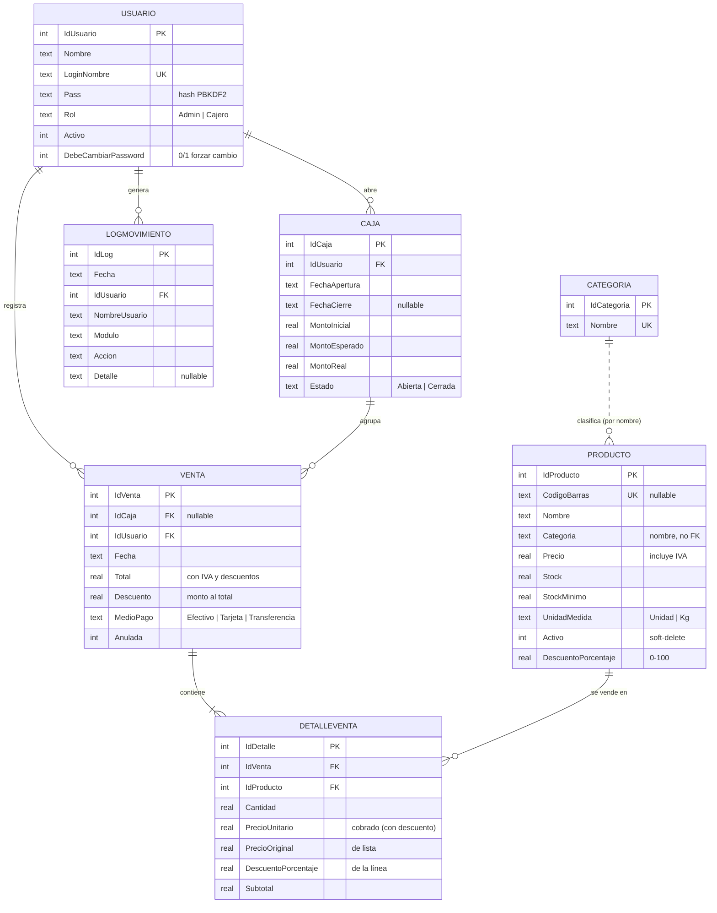

# Modelo de datos

Base de datos **SQLite** (`pos.db`, una caja) o **SQL Server** (base `PosMaqueta`, varias cajas),
creada y migrada automáticamente al arrancar por `AccesoData/DatabaseInitializer.cs`. Todos los
montos en **pesos chilenos** (sin decimales).

> El mismo esquema corre en ambos motores. Equivalencias de tipos: `INTEGER`/`INT IDENTITY`,
> `REAL`/`DECIMAL(18,4)`, `TEXT`/`NVARCHAR`. Las **fechas se guardan como texto** (`yyyy-MM-dd
> HH:mm:ss`) en ambos para que el código sea portable. Ver [DESPLIEGUE.md](DESPLIEGUE.md).

## Diagrama entidad-relación

> **Nota:** `Producto.Categoria` guarda el **nombre** de la categoría como texto (no es una clave
> foránea a `Categoria`). La tabla `Categoria` es la lista maestra que alimenta los filtros de
> Ventas; `DatabaseInitializer.SincronizarCategorias()` inserta en `Categoria` toda categoría
> usada por algún producto que falte, para mantenerlas alineadas.

---

## Tablas

### `Usuario`
Cuentas que operan el sistema.

| Columna | Tipo | Notas |
|---|---|---|
| `IdUsuario` | INTEGER PK | autoincremental |
| `Nombre` | TEXT | nombre visible |
| `LoginNombre` | TEXT **UNIQUE** | usuario de inicio de sesión |
| `Pass` | TEXT | hash **PBKDF2** (`iter$salt$hash`) |
| `Rol` | TEXT | `Admin` o `Cajero` (constantes `RolUsuario`) |
| `Activo` | INTEGER | 1 activo / 0 inactivo |
| `DebeCambiarPassword` | INTEGER | 1 = obliga a cambiar la contraseña en el próximo ingreso |

### `Categoria`
Lista maestra de categorías (filtros de Ventas).

| Columna | Tipo | Notas |
|---|---|---|
| `IdCategoria` | INTEGER PK | autoincremental |
| `Nombre` | TEXT **UNIQUE** | nombre de la categoría |

### `Producto`
Catálogo. Los precios **incluyen IVA**.

| Columna | Tipo | Notas |
|---|---|---|
| `IdProducto` | INTEGER PK | autoincremental |
| `CodigoBarras` | TEXT **UNIQUE** | puede ser NULL (varios NULL permitidos) |
| `Nombre` | TEXT | |
| `Categoria` | TEXT | nombre de la categoría (no FK) |
| `Precio` | REAL | precio de venta (con IVA) |
| `Stock` | REAL | admite decimales (venta por kg) |
| `StockMinimo` | REAL | umbral de alerta de bajo stock |
| `UnidadMedida` | TEXT | `Unidad` o `Kg` |
| `Activo` | INTEGER | *soft-delete* (1/0) |
| `DescuentoPorcentaje` | REAL | oferta 0–100 % (0 = sin descuento) |

### `Caja`
Turnos de caja (apertura/cierre con arqueo).

| Columna | Tipo | Notas |
|---|---|---|
| `IdCaja` | INTEGER PK | autoincremental |
| `IdUsuario` | INTEGER **FK → Usuario** | quién abrió |
| `FechaApertura` | TEXT | `yyyy-MM-dd HH:mm:ss` |
| `FechaCierre` | TEXT | NULL mientras está abierta |
| `MontoInicial` | REAL | fondo de caja |
| `MontoEsperado` | REAL | fondo + ventas en efectivo |
| `MontoReal` | REAL | contado al cerrar |
| `Estado` | TEXT | `Abierta` o `Cerrada` |

### `Venta`
Cabecera de cada venta.

| Columna | Tipo | Notas |
|---|---|---|
| `IdVenta` | INTEGER PK | autoincremental |
| `IdCaja` | INTEGER **FK → Caja** | NULL si no hay caja abierta |
| `IdUsuario` | INTEGER **FK → Usuario** | cajero |
| `Fecha` | TEXT | `yyyy-MM-dd HH:mm:ss` |
| `Total` | REAL | final (con IVA y descuentos) |
| `Descuento` | REAL | descuento al total, en $ |
| `MedioPago` | TEXT | `Efectivo` / `Tarjeta` / `Transferencia` |
| `Anulada` | INTEGER | 1 si fue anulada (excluida de reportes) |

### `DetalleVenta`
Líneas (ítems) de cada venta.

| Columna | Tipo | Notas |
|---|---|---|
| `IdDetalle` | INTEGER PK | autoincremental |
| `IdVenta` | INTEGER **FK → Venta** | |
| `IdProducto` | INTEGER **FK → Producto** | |
| `Cantidad` | REAL | |
| `PrecioUnitario` | REAL | precio cobrado (ya con descuento) |
| `PrecioOriginal` | REAL | precio de lista antes del descuento |
| `DescuentoPorcentaje` | REAL | % aplicado a esta línea |
| `Subtotal` | REAL | `Cantidad × PrecioUnitario` |

### `LogMovimiento`
Auditoría de operaciones (no es el log técnico a archivo).

| Columna | Tipo | Notas |
|---|---|---|
| `IdLog` | INTEGER PK | autoincremental |
| `Fecha` | TEXT | |
| `IdUsuario` | INTEGER **FK → Usuario** | |
| `NombreUsuario` | TEXT | |
| `Modulo` | TEXT | p. ej. `Productos`, `Ventas` |
| `Accion` | TEXT | p. ej. `Alta`, `Venta`, `Anulación` |
| `Detalle` | TEXT | descripción (nullable) |

---

## Índices

Creados en `DatabaseInitializer.CrearIndices()` (idempotentes) para acelerar filtros y uniones:

| Índice | Columna(s) | Acelera |
|---|---|---|
| `idx_venta_fecha` | `Venta(Fecha)` | reportes por período |
| `idx_venta_caja` | `Venta(IdCaja)` | resumen/arqueo de caja |
| `idx_detalle_venta` | `DetalleVenta(IdVenta)` | detalle de una venta, anulación |
| `idx_detalle_producto` | `DetalleVenta(IdProducto)` | top productos, "tiene ventas" |
| `idx_producto_categoria` | `Producto(Categoria)` | filtro por categoría en Ventas |
| `idx_log_fecha` | `LogMovimiento(Fecha)` | filtro del log por fecha |

Además, las columnas `UNIQUE` (`Usuario.LoginNombre`, `Producto.CodigoBarras`, `Categoria.Nombre`)
generan índices implícitos.

---

## Migraciones

El esquema se crea con `CREATE TABLE IF NOT EXISTS` y se **migra de forma incremental e
idempotente**: `MigrarEsquema()` comprueba con `PRAGMA table_info` si una columna existe y, si
no, ejecuta `ALTER TABLE ... ADD COLUMN`. Así una BD vieja se actualiza sin perder datos.

Columnas agregadas por migración: `Venta.Anulada`, `Venta.Descuento`,
`Producto.DescuentoPorcentaje`, `DetalleVenta.PrecioOriginal`, `DetalleVenta.DescuentoPorcentaje`,
`Usuario.DebeCambiarPassword` (al agregarla, marca al `admin` existente para forzar el cambio).

**Versionado de esquema.** La tabla `SchemaVersion(Version)` guarda la versión del esquema. Al
arrancar, si la BD trae una versión **mayor** que la del binario (otra caja se actualizó antes), la
app **se niega a arrancar** con un mensaje claro, en vez de operar contra un esquema desconocido.
La versión actual es `DatabaseInitializer.ESQUEMA_VERSION`.

## Modo WAL

Al inicializar se fija una vez `PRAGMA journal_mode=WAL` (persistente en el archivo) y
`PRAGMA synchronous=NORMAL`: permite lecturas concurrentes mientras se escribe una venta y
reduce los `fsync` por commit. El respaldo hace `wal_checkpoint(TRUNCATE)` antes de copiar el
`.db` para que la copia sea consistente.

## Datos sembrados (primer arranque)

- `admin` / `admin123` — Nombre "Administrador", **Rol `Admin`** (`RolUsuario.Admin`).
- `empleado` / `empleado123` — Nombre "Empleado Demo", Rol `Cajero` (idempotente).
- Categorías de ejemplo: Abarrotes, Bebidas, Lácteos, Panadería, Limpieza, Otros.

---

Ver también: [ARQUITECTURA.md](ARQUITECTURA.md) · [MANUAL-USUARIO.md](MANUAL-USUARIO.md)
