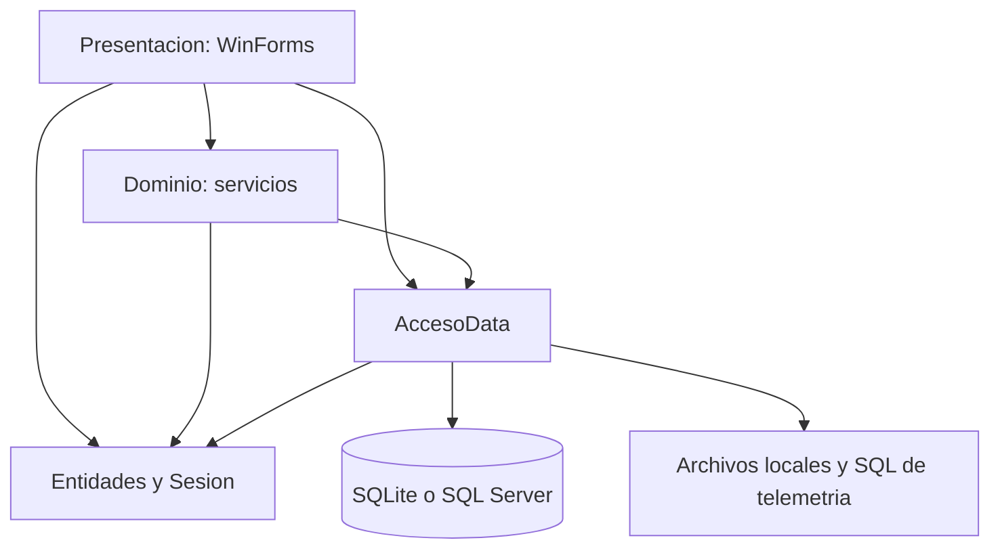

# 01 · Diagnóstico del proyecto actual

Fecha: 2026-09-24. Commit: `5d05101`. [Índice](README.md).

## Método y límites

Se revisaron la solución y los cinco proyectos, el inventario de código de todas las capas, los formularios y sus manejadores funcionales, entidades, servicios, DAOs, esquema/migraciones, configuración, perfiles de publicación, documentación y pruebas. Se siguieron particularmente los flujos de venta, caja, devolución, autenticación, importación y respaldo.

La evidencia combina inspección estática y ejecución de la suite que no usa SQL Server. No se ejecutó la interfaz, no se inspeccionó una base de producción ni se probaron dispositivos, hardware, cargas reales o SQL Server. Un riesgo identificado en código no equivale a un fallo reproducido. No se calculó cobertura de líneas.

## Inventario técnico

| Proyecto | Archivos C# | Líneas físicas | Responsabilidad | Dependencias principales |
|---|---:|---:|---|---|
| `Entidades` | 19 | 379 | Modelos y cálculos básicos | BCL; contiene también `Sesion` estática |
| `AccesoData` | 16 | 2.692 | 7 DAOs, conexión, esquema, seguridad, logs y respaldos | Entidades, Microsoft.Data.Sqlite 8.0.10, System.Data.SqlClient 4.8.6 |
| `Dominio` | 12 | 1.346 | 9 servicios, autorización, errores, notificación | Entidades y AccesoData |
| `Presentacion` | 26 | 7.327 | 17 formularios, 5 diseñadores, arranque y utilidades visuales | Las tres capas; WinForms, Drawing, Configuration, VisualBasic |
| `PosMaqueta.Tests` | 16 | 1.952 | 14 clases de pruebas y 2 archivos de soporte | xUnit 2.9.2, Test SDK 17.11.1, runner 2.8.2, SkippableFact 1.5.23 |
| **Total** | **89** | **13.696** | Incluye comentarios, blancos y diseñadores | Excluye `bin/obj` |

Todos los proyectos usan `net472`, C# 8 y nullable desactivado. Los `.csproj` ya son SDK-style, lo que facilita extraer bibliotecas, pero no vuelve portables las APIs Windows. No se encontró `global.json`, pipeline de CI ni una aplicación web/API en el árbol versionado examinado.

El [inventario estructurado](evidencias/inventario-codigo.json) registra cada archivo C# y su número de líneas para poder contrastar el alcance del análisis con cambios posteriores.

## Cobertura funcional y destino

Las rutas de esta tabla son relativas a la raíz; los nombres corresponden al código, no solo al README.

| Módulo y archivos | Comportamiento actual | Tratamiento en MAUI |
|---|---|---|
| `FormLogin`, `FormCambiarPassword`, `FormVerificarAdmin`; `UsuarioService`, `UsuarioDao`, `Seguridad` | Login, PBKDF2, migración desde SHA256, cambio obligatorio, validación de administrador | Páginas/diálogos MVVM; separar credenciales centrales y permiso offline; autorización fuera de la vista |
| `FormPrincipal`, `EstiloPos`, `UI/Aviso`, `UI/Errores` | Navegación por formularios, sidebar, atajos, estilos y mensajes | Shell, recursos XAML, navegación y diálogos por interfaces; adaptación a móvil |
| `FormDashboard` | Ventas del día, bajo stock y caja abierta | Proyección local por terminal; distinguir consolidado y datos pendientes |
| `FormVentas` y diseñador; `VentaService`, `VentaEnCurso` | Código HID, búsqueda, tarjetas, múltiples carritos, descuento, expiración de pausadas | `VentasViewModel`, borradores persistentes por sesión/terminal, catálogo virtualizado |
| `FormCobroEfectivo`, `FormCobroMixto`; `PagoVenta` | Vuelto, desglose efectivo/tarjeta/transferencia | Estado de cobro explícito, doble toque protegido y confirmación local duradera |
| `FormProductos`, `FormGestionCategorias`; servicios y DAOs respectivos | CRUD, stock, descuentos, costo y margen; categorías por nombre | Separar edición del catálogo de movimientos de stock; identificadores estables |
| `ImportacionService` | CSV coma/punto y coma, comillas, errores por fila; coincide por código o nombre | Parser desde `Stream`, previsualización, validación cultural y aplicación controlada |
| `FormCaja`, `FormHistorialCajas`; `CajaService`, `CajaDao` | Apertura, arqueo, faltante validado por diálogo admin, historial | Turno por terminal, política de cierre en aplicación, aprobación verificable |
| `FormReportes`, `FormDetalleVenta`; consultas `VentaDao` | Fechas, pagos, IVA, utilidad, inventario y rankings | Consultas específicas y fórmulas corregidas; permisos y antigüedad visibles |
| `FormDevolucion`; `DevolucionService/Dao`, `VentaService.AnularVenta` | Devoluciones parciales, efectivo y reintegro; anulación excluyente | Operaciones compensatorias, validación transaccional y política entre dispositivos |
| `FormUsuarios`; `UsuarioService/Dao` | Altas, roles, activación, último admin, reseteo | Administración central; DTOs sin hashes; caché de permisos mínima |
| `FormRespaldos`; `RespaldoService`, `RespaldoBD` | Backups diarios/manuales, copia externa, restauración y reinicio | Snapshot consistente; recuperación coordinada con colas y servidor |
| `LogService/Dao`, `Log`, `LogRemoto`, `NotificadorCambios` | Auditoría SQL, log local, cola de errores opcional hacia SQL central, eventos en proceso | Auditoría transaccional; telemetría HTTPS separada; notificación posterior al commit |

`Entidades` incluye 19 archivos: además de modelos operativos contiene `Dinero`, `Impuestos`, `ResumenVentas`, `ResumenCaja`, `ProductoVendido`, `ResultadoImportacion`, `RespaldoInfo`, constantes de roles y la sesión. Conviene separar los DTOs de consulta y el estado de usuario del dominio puro.

## Persistencia y flujos críticos

Hay 11 tablas incluyendo `SchemaVersion`, con versión actual **4**: categorías, usuarios, productos, cajas, ventas, detalles, pagos, devoluciones, ítems devueltos y auditoría. SQLite usa afinidad `REAL` para montos/cantidades; SQL Server usa decimales. Las fechas se guardan como texto local sin offset. Categoría se asocia por nombre, no por FK. Ver [inicializador](../../AccesoData/DatabaseInitializer.cs) y [modelo existente](../MODELO-DATOS.md).

En [VentaDao.RegistrarVenta](../../AccesoData/DAO/VentaDao.cs) se guardan cabecera, detalles, pagos y descuento de stock en una transacción. El `UPDATE ... WHERE Stock >= @cantidad` evita stock negativo dentro de esa base. Es una defensa valiosa que se debe conservar. No coordina dos bases SQLite desconectadas.

[VentaService.CobrarVenta](../../Dominio/Servicios/VentaService.cs) valida stock y caja antes de llamar al DAO. Después del commit registra auditoría, cierra el carrito y emite eventos. La auditoría y los suscriptores pueden fallar cuando la venta ya está confirmada: la pantalla puede presentar error y conservar el carrito, permitiendo un segundo cobro. Falta un identificador persistente de operación.

La anulación tiene actualización condicional y evita repetirse secuencialmente. Las comprobaciones cruzadas entre anular y devolver están fuera de sus transacciones; eso requiere endurecimiento para concurrencia y sincronización.

## Hallazgos priorizados

**R:** reproducido por pruebas. **E:** observado directamente en código. **I:** riesgo inferido de ese flujo; necesita prueba específica. P0 bloquea usar el comportamiento como referencia financiera; P1 bloquea el piloto distribuido; P2 corresponde a portabilidad/operación.

| ID | Prioridad/evidencia | Hallazgo y ubicación | Acción propuesta |
|---|---|---|---|
| H01 | P0 · R/E | `DevolucionDao.Registrar` resta de `Venta.Total`; `ResumenVentas.TotalNeto` resta otra vez. Falla `ResumenVentas_refleja_las_devoluciones` | Preservar venta original y modelar devolución separada; reparar/conciliar datos previos con reglas explícitas |
| H02 | P0 · E/I | `DevolucionService.Devolver` usa precio de línea sin distribuir el descuento global; permite ítems repetidos con validación individual | Agrupar/rechazar repetidos; distribuir descuento con redondeo determinista y límite acumulado de devolución |
| H03 | P1 · E/I | `VentaService.CobrarVenta`: auditoría y eventos después del commit sin clave de operación | Guardar auditoría/outbox atómicamente; respuesta recuperable e idempotente |
| H04 | P1 · E/I | `CajaDao.ObtenerCajaAbierta` consulta global; apertura hace check y luego insert; no hay terminal ni índice de turno abierto | Añadir terminal/turno e índice único aplicable; serializar apertura/cierre por terminal |
| H05 | P1 · E/I | `CobrarVenta` solo busca caja abierta cuando `idCaja` es null; cierre y venta pueden intercalarse | Validar existencia, estado, propietario y terminal en la transacción; FK no prueba estado |
| H06 | P1 · E/I | `FormCaja.btnCerrar_Click` valida admin, `CajaService.CerrarCaja` no recibe esa autorización | Llevar la regla al caso de uso; auditar quién aprobó, qué monto y qué turno |
| H07 | P1 · E/I | Guardas de devolución/anulación fuera de transacción; ajustes de inventario hacen lectura y escritura absoluta | Bloqueo/versionado en servidor; movimientos de stock e idempotencia; evitar pérdida de actualizaciones |
| H08 | P1 · E | Reportes y consultas de usuarios no exigen admin en servicios; login/cambio obligatorio dependen de UI | Matriz de permisos para cada caso de uso y endpoint; derivar actor de contexto autenticado |
| H09 | P1 · E | `Sesion`, carritos, `ConfigBD`, notificador y telemetría usan estado estático | Contextos de sesión/terminal inyectados; nunca sesión estática en servidor |
| H10 | P1 · E/I | `ProductoService.Validar` y pagos no garantizan enteros CLP para todas las entradas; `AgregarProducto` acepta objeto mutable sin validaciones completas | Centralizar invariantes y límites; validar cada pago, actividad del producto y cantidades al confirmar |
| H11 | P1 · E/I | `RespaldoBD.CrearCopia` hace checkpoint y luego `File.Copy` mientras podrían continuar escrituras | Backup API consistente; restauración en mantenimiento, con validación e identidad de réplica |
| H12 | P2 · E | Rutas en `AppDomain.BaseDirectory`, `explorer.exe`, `Application.Restart`, temporizadores WinForms | `AppDataDirectory`, streams, share/file picker, adaptadores y ciclo de vida MAUI |
| H13 | P1 · E | `LogRemoto` escribe directo a SQL Server; su cola puede descartar errores antiguos | HTTPS y límites; jamás reutilizar esa política de descarte para transacciones de venta |
| H14 | P1 · E/I | `DatabaseInitializer` modifica tablas antes de comprobar versión; migraciones no forman una unidad completa y usan `ADD COLUMN` en camino compartido | Migraciones separadas por proveedor, bloqueo exclusivo y comprobación antes de mutar; validar upgrade SQL Server antiguo |
| H15 | P2 · E/I | CSV intenta cultura invariante primero con `NumberStyles.Number`; `1,5` puede interpretarse como miles; costo cero se trata como ausente | Contrato CSV explícito; distinguir vacío de cero; conservar intención y errores por fila |
| H16 | P1 · E | Costos/rankings usan detalles originales, no cantidades devueltas ni reparto del descuento global | Definir venta bruta, devolución, costo neto y utilidad; casos de prueba por fecha de operación |

H02, H03 y los escenarios de concurrencia son observaciones estáticas; no se crearon pruebas nuevas ni se modificó código para reproducirlos en este trabajo. H14 no afirma que SQL Server nuevo falle: el riesgo es actualizar un esquema antiguo con columnas faltantes.

## Reutilización estimada por naturaleza

| Componente | Reutilización | Trabajo real |
|---|---|---|
| `Dinero`, `Impuestos`, POCOs | Alta conceptual | Extraer, reforzar invariantes, separar DTOs/sesión; no copiar datos defectuosos |
| Servicios | Media | Extraer políticas, inyectar contratos, eliminar globales, separar carrito y confirmación |
| DAOs SQL | Media en consultas, menor en escritura distribuida | Conservar SQL útil y parametrización; nuevos límites transaccionales y esquema de sincronización |
| Pruebas | Alta como especificación inicial | Corregir referencia fallida, aislar fixtures y añadir fallos/concurrencia |
| WinForms/diseñadores | Baja a nivel de código | Rehacer XAML y UX; conservar vocabulario, flujos y tokens visuales |
| Respaldo, telemetría y arranque | Baja sin adaptación | Ciclo de vida móvil, rutas, HTTPS, recuperación y composición por DI |

No se ofrece un porcentaje global de reutilización: líneas reutilizadas no predicen el costo de validar un POS offline.

## Diferencias con la documentación anterior

El README informa 162 pruebas y el documento de correcciones registra 173 verdes en junio. El código actual declara 131 `Fact`, 11 `Theory` con 42 casos `InlineData`, y 9 `SkippableFact`: se esperan 182 casos contando SQL Server; esta ejecución seleccionó 173. Los resultados históricos no describen la ejecución actual.

El README dice apertura de caja solo admin; `FormCaja.RefrescarEstado` y `CajaService.AbrirCaja` permiten cajero. Se propone conservar esa operación con permiso explícito. Reembolso en efectivo sí es una decisión expresa previa, no un defecto que se deba cambiar automáticamente.

El soporte SQL Server existente no equivale a sincronización offline. `TiendaId` y `CajaId` de `App.config` identifican telemetría; no son particiones de las tablas operativas. Las tareas antes diferidas por ser multicaja ahora son pertinentes por el alcance confirmado.

## Entorno verificado

Windows x64, SDK **9.0.300**, MSBuild **17.14.5**, sin workloads MAUI y sin `global.json`. Se pudieron compilar las bibliotecas y pruebas `net472`. No se instaló SDK 10, workload ni emulador. El resultado completo y el comando reproducible están en [validación](05-VALIDACION-Y-OPERACION.md).
