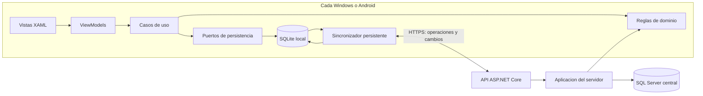

# 02 · Arquitectura propuesta

Fecha: 2026-09-24. [Índice](README.md). Todo lo descrito aquí es diseño objetivo, no implementación existente.

## Elección para este POS

**MAUI nativo con XAML + MVVM, arquitectura por capas con dependencias hacia el núcleo, persistencia local y servidor modular.** MVVM organiza la interfaz; los puertos de aplicación separan negocio, base de datos, red y plataforma. Se aplican principios de Clean Architecture de forma acotada al proyecto.

Microsoft documenta la separación vista/ViewModel y el uso de comandos para una interfaz comprobable. El MVVM Toolkit aporta `ObservableObject`, `RelayCommand` y `AsyncRelayCommand` sin obligar a incorporar otro framework de navegación. La elección concreta para este repositorio es una recomendación de este análisis. [MVVM en MAUI](https://learn.microsoft.com/en-us/dotnet/architecture/maui/mvvm), [CommunityToolkit.Mvvm](https://learn.microsoft.com/en-us/dotnet/communitytoolkit/mvvm/).

| Alternativa | Encaje | Decisión |
|---|---|---|
| XAML + MVVM Toolkit + DI integrada | C# existente, periféricos, teclado y UX móvil; no hay componentes web que reutilizar | Recomendada |
| MAUI Blazor Hybrid | Interesante con un futuro cliente web y equipo Razor; agrega WebView y otra tecnología de UI | Reevaluar si web pasa a ser objetivo; hoy no justifica la complejidad |
| Prism/ReactiveUI u otro framework amplio | Puede facilitar navegación avanzada o flujos reactivos; agrega convenciones/dependencias | No necesario para los 17 formularios actuales; evaluar solo ante una necesidad concreta |
| Portar todo conservando servicios estáticos | Reduce cambios iniciales, pero mantiene acoplamiento y no permite servidor multiusuario seguro | Útil únicamente como prototipo descartable |
| Microservicios/event sourcing completo | Sobrecosto operativo para un minimarket y mayor dificultad de migración | Mantener API modular y tablas relacionales; usar movimientos/outbox específicos |

Blazor Hybrid ejecuta componentes Razor en el proceso nativo y los presenta en un WebView; no convierte automáticamente la aplicación en un sitio web. [Descripción oficial](https://learn.microsoft.com/en-us/aspnet/core/blazor/hybrid/?view=aspnetcore-10.0).

## Estructura de solución

Nombres propuestos para evitar confundir el `Dominio` actual, que contiene orquestación y acceso concreto a datos, con el futuro dominio puro.

```text
src/
  Pos.Domain/                 # Dinero, reglas, modelos y políticas puras
  Pos.Application/            # Casos de uso y contratos de sus dependencias
  Pos.Contracts/              # DTOs versionados de API/sincronización, sin secretos
  Pos.Infrastructure.Local/   # SQLite, migraciones, outbox, borradores, backup
  Pos.Infrastructure.Remote/  # HTTP, sincronización y almacenamiento seguro abstracto
  Pos.Presentation/           # ViewModels y contratos de navegación/diálogos, sin MAUI
  Pos.App/                    # MAUI: XAML, Shell, recursos, Platforms, composición
  Pos.Server/                 # ASP.NET Core: identidad, endpoints, administración
  Pos.Infrastructure.Server/  # SQL Server, inbox, proyecciones y migraciones
tests/
  Pos.Domain.Tests/
  Pos.Application.Tests/
  Pos.Presentation.Tests/
  Pos.Infrastructure.Tests/
  Pos.Sync.Tests/
  Pos.Api.Tests/
  Pos.App.UITests/
tools/
  Pos.DataMigration/          # Importación/conciliación de legado, ejecutable aparte
```

Se crean los proyectos cuando la etapa los necesite. Agrupar las dos infraestructuras del cliente en un solo proyecto al principio es aceptable si se mantienen namespaces y límites claros. No crear ensamblados por cada entidad.

| Proyecto | Referencias permitidas | Restricciones |
|---|---|---|
| Domain | BCL | Sin MAUI, SQL, HTTP, sesión estática o reloj del sistema directo |
| Application | Domain | Define puertos; sin DAOs concretos ni tipos de UI |
| Contracts | BCL/serialización acordada | No exponer entidades persistidas ni `Usuario.Pass` |
| Infrastructure.Local | Application, Domain | Implementa transacciones completas y almacenamiento local |
| Infrastructure.Remote | Application, Contracts | Coordina push/pull mediante puertos; no escribe SQL directamente |
| Presentation | Application, MVVM Toolkit | Sin `ContentPage`, `Shell`, `DbConnection` o `HttpClient` |
| App | Presentation, Application, infraestructuras del cliente | Referencias concretas solo para registrar adaptadores y plataforma |
| Server | Application, Contracts, Infrastructure.Server | Usuario por solicitud, nunca `Sesion.UsuarioActual` |
| Infrastructure.Server | Application, Domain | La conexión central permanece exclusivamente aquí |

Para compartir con WinForms durante la transición, extraer primero bibliotecas puras `netstandard2.0` o multitarget `netstandard2.0;net10.0`, según APIs realmente necesarias. .NET Framework 4.7.2 puede consumir .NET Standard 2.0; no puede consumir directamente una biblioteca `net10.0`. No apuntar a .NET Standard 2.1 como puente. Retirar el target antiguo cuando WinForms salga de servicio. [Compatibilidad .NET Standard](https://learn.microsoft.com/en-us/dotnet/standard/net-standard?tabs=net-standard-2-0).

El cliente objetivo usa `net10.0-android` y `net10.0-windows10.0.19041.0` como TFMs iniciales propuestos. El sufijo del TFM Windows corresponde al SDK de compilación; no sustituye la configuración de versión mínima de ejecución. Las librerías nuevas sin puente y el servidor apuntan a `net10.0`.

## Despliegue y flujo



Las flechas del diagrama representan flujo en ejecución. En compilación, infraestructura implementa contratos de Application; Application no referencia infraestructura. La interfaz lee proyecciones locales incluso con conexión. El servidor consolida el conjunto; el cliente puede contener operaciones locales aún no recibidas por él.

Una sola autoridad central por tienda evita introducir replicación de servidores en esta migración. Puede desplegarse en el local o fuera de él. La URL y el mecanismo de enrolamiento se configuran; ninguna cadena SQL viaja al dispositivo. No se comparte un archivo SQLite por carpeta de red.

## Casos de uso y transacciones

Separar `VentaService` en preparación de carrito, cálculo puro, confirmación y consultas. La API no ofrece un CRUD genérico de las tablas: expone acciones del negocio.

| Caso de uso | Responsabilidad y contrato mínimo |
|---|---|
| `PrepararVenta` | Agregar/quitar cantidades, calcular importes y mantener un borrador por usuario/terminal |
| `ConfirmarVenta` | Validar sesión, turno, productos, importes, pagos y cupo; persistir venta completa una vez |
| `AbrirTurno` / `CerrarTurno` | Un turno abierto por terminal; conteo, autorizaciones y orden respecto de ventas |
| `RegistrarDevolucion` | Importe reembolsable y cantidades acumuladas, propiedad offline, efectivo y movimientos |
| `AnularVenta` | Exclusión con devoluciones, motivo, permisos, reintegro único y política de turno |
| `ModificarCatalogo` | Edición autorizada/versionada; nunca reemplaza el saldo de inventario |
| `RegistrarMovimientoStock` | Entrada/salida/ajuste como operación identificada, con motivo y control de versión |
| `ImportarCatalogo` | Lee stream, valida lote y aplica operaciones identificables; informa errores por fila |
| `Sincronizar` | Transporte reintentable, estado de operaciones, aplicación de cambios y cursor |

Contratos conceptuales, no código incorporado al repositorio:

```csharp
public interface IConfirmarVenta
{
    Task<ConfirmacionVenta> EjecutarAsync(
        ConfirmarVentaCommand comando, CancellationToken cancelacion);
}

public interface IVentaStore
{
    // Una transacción: venta, pagos, stock/cupo, auditoría y outbox.
    // Mismo OperationId y contenido: devuelve el resultado previamente guardado.
    Task<ConfirmacionVenta> ConfirmarUnaVezAsync(
        VentaValidada venta, ContextoOperacion contexto, CancellationToken cancelacion);
}

public interface IUsuarioActual { IdentidadSesion Obtener(); }
public interface IReloj { DateTimeOffset UtcNow { get; } }
public interface IArchivosApp { string DirectorioDatos { get; } }
```

Las comprobaciones que dependen del estado mutable de caja, stock o devoluciones se repiten dentro de `ConfirmarUnaVezAsync` o su equivalente transaccional. No es suficiente validar antes en el caso de uso. No crear un repositorio genérico que guarde cabecera, pagos y stock con conexiones distintas.

Cancelación antes del commit puede abortar. Después del commit el resultado se recupera por identificador; cancelar la navegación o sufrir timeout no equivale a cancelar una venta. Los errores de refresco o de telemetría no cambian su confirmación.

## MVVM, navegación y estado

- Vistas XAML con `x:DataType`, bindings compilados y `CollectionView` virtualizada. Código de vista limitado a foco, interacción visual y particularidades de hardware. [Bindings compilados](https://learn.microsoft.com/en-us/dotnet/maui/fundamentals/data-binding/compiled-bindings?view=net-maui-10.0).
- ViewModels por función con comandos asíncronos, estados cargando/error/vacío, búsqueda cancelable y debounce. Deshabilitar doble ejecución del cobro; la defensa definitiva sigue siendo idempotencia en persistencia.
- `AppShell` con rutas de acceso, ventas, catálogo, caja, reportes y administración. `INavigationService` evita acoplar ViewModels a `Shell.Current`. La navegación no concede permisos.
- Pasar IDs estables por rutas, no entidades mutables grandes. Tras volver a una pantalla, recargar proyecciones. No enviar contraseñas por parámetros de navegación.
- Sustituir `NotificadorCambios` por eventos tipados de invalidación emitidos después del commit. Suscripciones con vida controlada; despachar actualización de colecciones al hilo UI. Esos eventos en memoria no son el transporte de sincronización.
- `CarritoWorkspace` por sesión/terminal, con borradores SQLite; un contador estático no identifica ventas distribuidas. Al reanudar, preguntar al operador por el borrador apropiado sin mezclar usuarios.
- Guardar borradores durante cambios relevantes, no confiar únicamente en el cierre de aplicación. El sistema operativo puede finalizar la app; los eventos de ciclo de vida sirven para reanudar y liberar recursos, no garantizan una última escritura. [Ciclo de vida MAUI](https://learn.microsoft.com/en-us/dotnet/maui/fundamentals/app-lifecycle?view=net-maui-10.0).

### Vida de dependencias

| Dependencia | Vida propuesta |
|---|---|
| Configuración inmutable, fábrica de conexiones, reloj | Singleton |
| Coordinador de SQLite y sincronizador | Singleton por terminal, con acceso serializado a escrituras |
| Sesión/carritos | Scope explícito de sesión; desechar al salir y conservar solo borradores autorizados |
| Páginas/ViewModels | Transient o scope explícito de navegación; liberar suscripciones |
| Conexión/transacción SQLite | Por operación, nunca una transacción abierta durante navegación o espera HTTP |
| Servicios del servidor | Scope por solicitud; trabajo de fondo crea su propio scope |

MAUI no crea automáticamente un scope por página como un servidor lo hace por solicitud HTTP. Si se usa `AddScoped`, el dueño del scope debe crearlo y disponerlo; no capturar un servicio de sesión en un singleton. [DI integrada de MAUI](https://learn.microsoft.com/en-us/dotnet/maui/fundamentals/dependency-injection?view=net-maui-10.0).

## Persistencia y asincronía

Mantener inicialmente `Microsoft.Data.Sqlite` y SQL parametrizado detrás de contratos. Es una alternativa documentada para MAUI y permite aprovechar el conocimiento del esquema actual. Evaluar su empaquetado nativo y versiones en builds Release Android/Windows antes de fijar paquetes. No cambiar a EF Core simultáneamente con UI, esquema y sincronización. [SQLite en MAUI](https://learn.microsoft.com/en-us/dotnet/maui/data-cloud/database-sqlite?view=net-maui-10.0).

Los métodos ADO.NET asíncronos de `Microsoft.Data.Sqlite` ejecutan trabajo síncrono. La firma `Task` no basta para no bloquear la UI: el adaptador debe ejecutar operaciones completas en un trabajador controlado, serializar escritores y entregar resultados al ViewModel. Usar WAL, transacciones cortas y límites medidos. `Task.Run` disperso entre botones no es la solución. [Limitación oficial de asincronía](https://learn.microsoft.com/en-us/dotnet/standard/data/sqlite/async).

En servidor, comenzar con SQL explícito y el proveedor moderno `Microsoft.Data.SqlClient`, validado en la etapa correspondiente. EF Core sigue siendo una opción futura si la complejidad de consultas/mapeo lo justifica; no es requisito para Clean Architecture, transacciones u outbox. [Proveedor SQL Server y compatibilidad](https://learn.microsoft.com/en-us/sql/connect/ado-net/introduction-microsoft-data-sqlclient-namespace?view=sql-server-ver17).

## Plataforma, UX y periféricos

| Necesidad | Windows | Android | Puerto o decisión |
|---|---|---|---|
| Venta | Catálogo y carrito lado a lado; HID y atajos | Flujo táctil; carrito dedicado en teléfono, panel dual en tablet | Mismos casos de uso, layouts adaptativos |
| Escaneo | Entrada HID con delimitador/foco controlado | HID Bluetooth/USB si equipo lo admite; cámara posterior | `IBarcodeScanner`; cámara requiere permiso y SDK evaluado |
| Impresión/cajón | Adaptador al equipo real | Bluetooth/USB/red según fabricante | `IReceiptPrinter`, `ICashDrawer`; capacidades detectables |
| Archivos CSV | Selector de archivo | Selector Android devuelve acceso vía stream | `IFilePicker`/adaptador; no asumir ruta física estable |
| Respaldo exportable | Archivo externo elegido por admin | Compartir/guardar mediante mecanismo del sistema | `IBackupExporter`; backup interno no sustituye externo |
| Almacenamiento | Directorio privado de la app | Directorio privado de la app | `IArchivosApp` usa `FileSystem.AppDataDirectory` |
| Formato | es-CL, teclado numérico y lector | es-CL, teclado táctil, accesibilidad y rotación | Recursos `.resx`, dinero sin fracciones y kg con precisión pactada |

La apertura del cajón y los periféricos futuros del roadmap no se declaran implementados. La fase inicial debe demostrar el lector existente. Botones y etiquetas deben distinguir «venta guardada» de «pendiente de sincronizar» sin mostrar detalles internos de colas o bases al cajero.

## Seguridad aplicada al nuevo alcance

Autorización en casos de uso y endpoints, además de visibilidad de controles. El actor, tienda y dispositivo se obtienen de identidad autenticada y enrolamiento; un `IdUsuario` o `Rol` en JSON no otorga permisos. Usuarios/contraseñas/cambios de rol se administran con conexión; el login offline utiliza un mecanismo de desbloqueo local y permiso firmado de alcance limitado, detallado en [sincronización](03-DATOS-Y-SINCRONIZACION.md).

Guardar tokens y material local de desbloqueo protegido en `SecureStorage` mediante adaptador. No sincronizar hashes centrales a todos los terminales ni incorporar secretos al paquete/configuración. `SecureStorage` no cifra automáticamente SQLite; deben evaluarse cifrado de dispositivo, protección de datos y exclusión de secretos del backup. La restauración Android puede invalidar valores de almacenamiento seguro: manejar el error como necesidad de reenrolar, sin borrar operaciones pendientes. [SecureStorage](https://learn.microsoft.com/en-us/dotnet/maui/platform-integration/storage/secure-storage?view=net-maui-10.0).

TLS con validación de certificado, identidad de dispositivo revocable y límites de intentos. No reutilizar `TrustServerCertificate=true` como política de API. La política de contraseñas centrales se versiona y rehashea al autenticar; la migración conserva verificación legacy solo para convertir cuentas existentes.

## Compatibilidad y alcance real

La matriz inicial del producto es Windows 11 x64 y Android 10+ arm64, ampliable después de medir equipos reales. MAUI tiene mínimos técnicos diferentes; no basta con que un sistema pueda ejecutar el runtime para comprometer soporte de todos sus periféricos. iOS/macOS exigirían certificación separada y, para iOS, acceso a un Mac de compilación. [Plataformas y herramientas](https://learn.microsoft.com/en-us/dotnet/maui/supported-platforms?view=net-maui-10.0).
