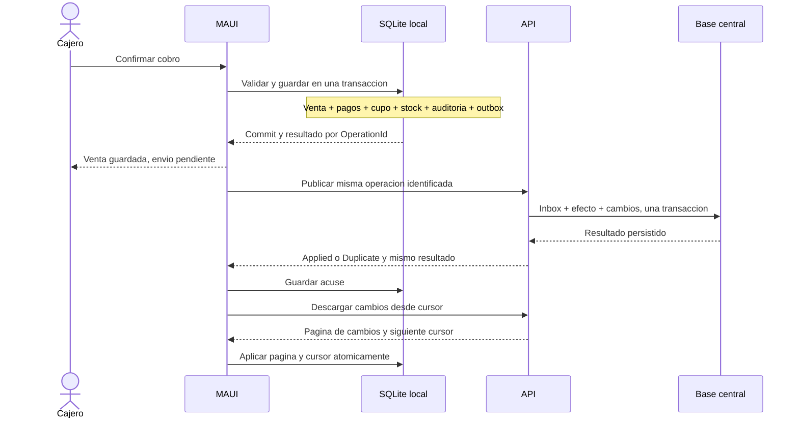

# 03 · Datos, operación offline y sincronización

Fecha: 2026-09-24. [Índice](README.md). Diseño propuesto; requiere pruebas de concepto y validación operativa.

## Contrato de funcionamiento

Cada terminal confirma su trabajo en una base local antes de informar éxito. Un servidor único por tienda consolida operaciones de Windows y Android. La red puede faltar durante el cobro; el stock vendible depende del cupo del terminal y la autorización offline vigente.

El patrón offline con fuente local para la interfaz está documentado por Android. Aquí se adapta a C#/MAUI; no se propone incorporar Room ni bibliotecas Kotlin. [Arquitectura offline de Android](https://developer.android.com/topic/architecture/data-layer/offline-first).

| Función | Con conexión | Sin conexión: propuesta inicial |
|---|---|---|
| Enrolar dispositivo / primer acceso | Servidor obligatorio | No disponible |
| Abrir sesión existente | Autenticación y renovación de permiso | Desbloqueo local con permiso firmado vigente, usuario previamente habilitado |
| Catálogo / búsqueda / borradores | Proyección local actualizada | Última versión local, con fecha de actualización |
| Venta y pago registrado | Commit local y posterior envío | Permitido con cupo, turno y permiso válidos; tarjeta/transferencia requieren comprobación externa habitual |
| Abrir/cerrar turno | Por terminal; se consolida por secuencia | Permitido bajo permiso; cierre local provisional hasta recepción de todas las operaciones |
| Devolver/anular | Coordinación central para ventas publicadas | Solo venta propia nunca entregada al sincronizador; al iniciar publicación deja de ser elegible offline |
| Catálogo, usuarios y cupos | Escrituras versionadas centrales | Solo consulta; preparar borrador administrativo no aplica cambios globales |
| Reporte consolidado | Servidor, indicando terminales pendientes | Vista local; no presentar un total parcial como total de la tienda |
| Restaurar / reenrolar | Recuperación controlada | No volver a habilitar venta desde una copia antigua sin conciliación |

La restricción de devoluciones offline es una propuesta inicial, no una preferencia confirmada del usuario. Para ampliarla a ventas ya publicadas hay que reservar derechos de devolución por venta/línea antes de desconectar. Una copia local del ticket no demuestra que otra caja no haya devuelto ya el producto.

## Identidad, dinero y tiempo

| Dato | Diseño objetivo |
|---|---|
| `StoreId`, `DeviceId` | Asignados/enrolados por servidor; nunca inferidos solamente del nombre del equipo |
| `ReplicaEpoch` | Identifica la encarnación de una instalación; cambia bajo recuperación controlada, no ante un simple reinicio |
| `SaleId`, `TurnId`, `ReturnId`, `OperationId` | UUID generados antes del primer commit y conservados en cada reintento |
| Número visible | Folio interno por terminal + secuencia; no es un folio tributario |
| Identidad legacy | Mapa `(SourceDatabaseId, EntityType, LegacyId) -> GlobalId`; generado una vez y reutilizado |
| Dinero CLP | Entero de 64 bits en almacenamiento y contratos; cálculos intermedios con `decimal`, redondeo acordado |
| Cantidad | Escala fija por unidad; propuesta kg a milésimas, unidades enteras; verificar datos antes de imponer esa precisión |
| Tasas/descuentos | Entero escalado o decimal serializado sin pérdida; límites y versión de regla explícitos |
| Fechas nuevas | `OccurredAtUtc`, offset observado, `BusinessDate` y `ReceivedAtUtc`; zona comercial configurada |
| Orden de réplica | `DeviceSequence` persistente por epoch, no reloj de pared ni timestamp del teléfono |

El `OperationId` se crea al preparar la confirmación y se guarda con el intento/borrador. Un segundo toque, relanzamiento o timeout reutiliza ese ID. Un nuevo GUID en cada retry anula la deduplicación.

El histórico contiene `REAL` y fechas locales. Detectar fracciones, diferencias de redondeo y horas ambiguas; no redondear ni asignar UTC silenciosamente. Mantener valor/texto de origen y procedencia en el informe de importación. La tasa 19% se conserva como regla del proyecto, sin convertir esta migración en una revisión tributaria.

## Nuevas estructuras lógicas

Se mantiene un modelo relacional, con movimientos inmutables en las operaciones que los necesitan. Esta tabla es contrato lógico; el DDL físico se entrega y valida en las etapas 1/4.

| Estructura | Campos/índices esenciales | Ubicación |
|---|---|---|
| Terminal | StoreId, DeviceId, estado, epoch admitida | Central y proyección local |
| Turno | TurnId, DeviceId, operador, apertura, cierre, secuencia de cierre | Ambas; único turno abierto por terminal |
| Venta/Detalle/Pago | IDs globales, snapshots de descripción/código/precio/costo, descuentos distribuidos, turno | Ambas; venta original inmutable |
| Devolucion/Detalle | ReturnId, SaleId, cantidades, importe, efectivo, turno que entrega dinero | Ambas; acumulado limitado por línea |
| MovimientoStock | ID único, producto, cantidad firmada, motivo, operación origen | Ambas; no sincronizar `Stock = valor` |
| StockGrant | GrantId, producto, terminal/epoch, cantidad concedida, consumida, estado | Ambas; asignación exclusiva y versionada |
| OutboxOperation | OperationId PK, DeviceSequence único por epoch, tipo, versión, JSON, hash, dependencias, estado, reintentos | Local, en la misma base que la venta |
| InboxOperation | Clave única StoreId/OperationId, hash, resultado duradero, terminal/epoch | Servidor; misma transacción que el efecto |
| ChangeFeed | Cursor ordenado por commit, ámbito de tienda, tipo, ID, versión, tombstone | Servidor |
| SyncCheckpoint | Cursor confirmado, versión de protocolo, último contacto | Local |
| PendingProjection | Operaciones locales todavía no incluidas en la proyección central | Local; evita perder o duplicar efecto al hacer pull |
| DraftSale | Borrador, propietario, terminal, actividad e intento de confirmación | Local; no reserva global por existir |
| AuditEntry | Actor, aprobador si corresponde, operación, motivo, fechas y correlación | Atómica con operación de negocio |

Índices únicos además de PK: operación financiera por `OperationId`, secuencia por dispositivo/epoch, código normalizado por tienda para productos activos según la regla acordada, y un turno abierto por terminal. No aplicar borrado físico a entidades referidas por ventas; propagar desactivaciones/tombstones versionados.

## Venta local y envío confiable



Guardar negocio y mensaje juntos elimina la ventana entre commit y envío. El transporte puede duplicar mensajes: el consumidor debe ser idempotente. Es la adaptación relacional del patrón outbox; no implica contratar Cosmos DB, Service Bus ni un broker. [Patrón outbox documentado por Microsoft](https://learn.microsoft.com/en-us/azure/architecture/databases/guide/transactional-out-box-cosmos).

### Algoritmo de confirmación

1. Obtener identidad y permiso; comprobar que el intento no tiene resultado persistido. Rechazar mismo ID con contenido diferente.
2. En una única transacción local validar turno, precios autorizados/versionados, producto, cantidades, suma exacta de pagos y saldo del cupo. Consolidar líneas repetidas.
3. Guardar venta, detalles, pagos, consumo del cupo, movimiento de stock, auditoría, secuencia y operación de outbox. Marcar borrador confirmado en esa transacción.
4. Confirmar. Solo entonces informar éxito y limpiar el carrito visual. Si el resultado es incierto, consultarlo por ID.
5. Notificar vistas e iniciar sincronización como trabajo independiente. El fallo de envío nunca invita a cobrar otra vez.

Para no perder una venta confirmada ante corte eléctrico, evaluar `synchronous=FULL` con WAL y medir latencia en el equipo objetivo. El legado usa `NORMAL`; no asumir la misma garantía de durabilidad. [Garantías de PRAGMA synchronous](https://www.sqlite.org/pragma.html#pragma_synchronous).

### Push y deduplicación

- Un solo emisor local por réplica. Transiciones persistidas: `Pending -> Sending -> Acked`; al reiniciar, `Sending` vuelve a ser reintentable con el mismo ID.
- En servidor, después de autenticar al dispositivo, buscar recibo propio por `OperationId`. Si ya existe y el hash coincide, devolver resultado original sin repetir permisos mutables ni efectos. La consulta no puede cruzar tiendas.
- Para operaciones nuevas, validar permiso y reglas/versiones históricas autorizadas; no recalcular una venta antigua al precio actual. Validar importe y pagos desde snapshots autorizados, no confiar sin verificación en el total del cliente.
- Consumir cupo, persistir negocio, auditoría, recibo inbox y cambios en una transacción SQL. La restricción única resuelve solicitudes simultáneas; capturar conflicto y recuperar recibo.
- Backoff exponencial con jitter y límites de lote/tamaño. Reintentar cortes, 429 y fallos transitorios; renovar credenciales ante 401. No reintentar indefinidamente una validación imposible.
- Una operación con dependencia pendiente queda `WaitingDependency`; una inconsistencia queda `NeedsReview`. Ninguna venta cobrada se borra o descarta por llegar tarde. Su revisión puede generar una corrección compensatoria explícita.
- Los recibos de deduplicación financiera se conservan con el histórico. Si se archivan, se mantiene un índice que impida reaplicar IDs antiguos. Un TTL menor al tiempo de una restauración permitiría duplicados.

### Pull y convergencia

- El cursor representa cambios **confirmados y ordenados**. No usar el reloj del cliente ni `MAX(IDENTITY)` sin garantizar orden de commit: una transacción más lenta podría quedar detrás de un cursor ya entregado.
- Aplicar cada página, versiones por entidad y avance del cursor dentro de una transacción local. Repetir una página es inocuo. Cursor expirado exige snapshot con marca consistente y luego cambios posteriores.
- Mantener separación entre proyección central y efectos locales pendientes. Un pull no puede sobrescribir stock de ventas todavía no enviadas. Cuando llega el eco de una operación propia, sustituir el efecto pendiente por el central una sola vez por ID.
- Ventas del propio dispositivo no vuelven a descontar cupos al recibir su eco. El resultado del push y el change feed comparten IDs de operación/movimiento.
- Para cargas iniciales, snapshot paginado bajo versión estable y catch-up posterior; no consultar páginas sobre un catálogo que cambia sin una frontera consistente.
- Las desactivaciones se propagan como tombstones. No eliminar historia ni pendientes al refrescar caché. Si el dispositivo quedó más atrás que la retención de cambios, conservar outbox y conciliar antes de reemplazar proyecciones.

## Política de stock offline

**Recomendación:** cupos exclusivos por producto y terminal. Es una decisión de diseño derivada del requisito de no perder control de inventario, pendiente de prueba operativa.

Ejemplo: existen 10 unidades. El servidor concede 6 al terminal A y 4 al B. A puede vender 6 y B 4 sin conexión. La última unidad de B no puede venderse también en A. Si A agota su cupo, necesita conexión para solicitar más o transferirlo desde B con conciliación.

| Operación | Invariante |
|---|---|
| Conceder cupo | La suma de cupos pendientes y stock libre no supera las existencias disponibles al concederlos |
| Vender | Consumo acumulado de un GrantId no supera su cantidad; movimiento e inbox únicos |
| Venta con conexión | Usa el mismo sistema de cupos; no toma stock reservado para otra caja |
| Transferir cupo | El origen confirma liberación no consumida antes de concederla al destino |
| Expirar/revocar dispositivo | Impide nuevos permisos; **no libera** automáticamente cupo posiblemente consumido offline |
| Recibir devolución offline | Registra reintegro y efectivo; producto devuelto queda fuera del cupo vendible hasta conciliación |
| Ajuste físico/merma | Puede revelar diferencias reales; se registra y se revisan cupos, nunca se borra una venta aceptada |
| Reinstalar/restaurar | No recupera un cupo desde un backup sin verificar consumo central y operaciones locales pendientes |

La expiración del permiso limita ventas nuevas; el cupo retenido se libera únicamente tras reconciliar, o por procedimiento administrativo que asuma explícitamente la incertidumbre de un dispositivo perdido. El servidor guarda consumo de cupos como suma idempotente; no reemplaza su saldo con el reportado por el cliente.

Alternativa: permitir vender sobre el último stock conocido y conciliar sobreventas. Simplifica cupos, pero pierde la garantía de no sobreventa y necesita aceptación del negocio. No usar «última escritura gana» sobre stock/dinero: sobrescribiría ventas legítimas.

## Caja, descuentos y devoluciones

Cada dispositivo posee sus turnos. Apertura, ventas y cierre llevan secuencias; el cierre incluye la última secuencia y el conjunto/resumen de operaciones del turno. El servidor no lo declara conciliado hasta recibir todas sus dependencias. Se puede abrir el turno siguiente localmente después de cerrar el anterior; los cierres centrales no cambian los importes ya declarados en el arqueo.

El efectivo esperado conserva la regla actual: fondo inicial + pagos en efectivo - reembolsos en efectivo. La autorización de faltante queda ligada a `TurnId`, monto, aprobador y operación; no es un booleano generado por la UI. Caja cerrada rechaza nuevas ventas en la misma transacción.

La venta guarda importe original inmutable. Las devoluciones producen registros separados. Para descuentos globales, distribuir el descuento en las líneas proporcionalmente y asignar el residuo de pesos por un orden estable. En devoluciones parciales, limitar la suma reembolsada al importe asignado de cada línea y entregar cualquier residuo en la última devolución de esa línea. Esto evita devolver más que lo cobrado.

Ejemplo de referencia: venta original $3.000, devolución $2.000. Ventas brutas $3.000, devoluciones $2.000, venta neta $1.000. La devolución cuenta en su propia fecha comercial, según la decisión previa del proyecto. El costo neto y los rankings restan las cantidades devueltas; no basta con corregir el total general.

Para una venta aún no publicada, devolución/anulación y emisor de outbox comparten un bloqueo transaccional de propiedad: al marcarla `Sending`, deja de poder corregirse offline. Si se registró antes una devolución local, publicar venta y devolución en orden de dependencia. Las ventas ya publicadas se devuelven con coordinación central, incluso desde el dispositivo de origen. Reembolsar efectivo requiere resultado definitivo; un timeout se resuelve consultando la operación, no entregando dinero otra vez.

**Frontera de publicación:** el orden por sí solo no basta. Mientras la venta ya llegó al servidor y sus devoluciones locales todavía no, otra caja podría intentar devolverla. Al iniciar publicación se congela el conjunto local de correcciones y se agrega una operación `PublicationSealed` que depende de todas ellas. El servidor mantiene bloqueadas las correcciones remotas de esa venta hasta recibir ese cierre de publicación y sus dependencias; entonces libera su coordinación central. Puede implementarse como un único agregado transaccional de publicación si el tamaño lo permite. Un corte antes del cierre mantiene la venta registrada pero no reembolsable desde otra terminal hasta reanudar; no elimina ni repite el efectivo entregado localmente.

## Seguridad durante una desconexión

Propuesta: primer login online, enrolamiento del dispositivo y permiso offline firmado por el servidor con usuario, tienda, terminal/epoch, rol limitado, `PolicyVersion`, cupos, emisión y expiración. Duración inicial a validar: 24 horas. Guardar solo un verificador local de desbloqueo específico del dispositivo, protegido y con limitación de intentos; no replicar `Usuario.Pass` central. Al expirar, permitir lectura y conservar pendientes, pero bloquear nuevas ventas hasta renovar.

El permiso offline no es un access token de larga duración para todos los endpoints. Al reconectar se autentica el dispositivo para enviar operaciones; se valida la autorización bajo la cual se originaron, separada de los permisos actuales para administrar. Una revocación conocida puede requerir revisión de operaciones tardías, no su descarte.

No se puede garantizar revocación inmediata ni probar absolutamente la hora real en un equipo desconectado y manipulado. Detectar retrocesos de reloj comparando último tiempo de servidor y referencia monotónica; ante anomalía, exigir conexión. El modelo presupone terminales administrados, no dispositivos comprometidos. Este límite debe aceptarse para habilitar venta offline.

## API propuesta

Contratos v1 a materializar como OpenAPI en etapa 4. Los campos aquí son mínimos de diseño.

| Endpoint | Propósito |
|---|---|
| `POST /api/v1/devices/enroll` | Alta autenticada y autorizada del terminal; no inscripción anónima |
| `POST /api/v1/auth/session` | Autenticar, cambio obligatorio y sesión central; respuestas sin hash |
| `POST /api/v1/offline-permits` | Emitir/renovar permiso después de validar usuario, terminal y política |
| `POST /api/v1/stock-grants` | Asignar/transferir cupos con idempotencia y concurrencia |
| `POST /api/v1/sync/operations` | Lote acotado con resultado individual por operación; atomicidad por operación |
| `GET /api/v1/sync/operations/{operationId}` | Recuperar recibo y resolver respuesta perdida |
| `GET /api/v1/sync/changes?cursor=...&limit=...` | Cambios de la tienda autorizada y cursor siguiente |
| `GET /api/v1/sync/snapshot` | Bootstrap con versión consistente/paginación |
| `POST /api/v1/returns` y `/voids` | Correcciones coordinadas centrales, idempotentes |
| `/api/v1/catalog`, `/users`, `/reports` | Administración/consultas según permisos; escrituras con versión esperada |

Sobre de operación ilustrativo:

```json
{
  "operationId": "5c0abf1a-01ac-4df2-8140-05553d7379c8",
  "deviceSequence": 42,
  "replicaEpoch": 1,
  "type": "SaleConfirmed",
  "schemaVersion": 1,
  "occurredAtUtc": "2026-09-24T16:00:00Z",
  "businessDate": "2026-09-24",
  "offlinePermitId": "permiso-de-ejemplo",
  "dependsOn": [],
  "payloadHash": "sha256-del-contenido-canonico",
  "payload": {
    "saleId": "7d52f3e2-c7fb-4745-b4ea-9daed0574f11",
    "turnId": "b196e13b-2ae2-4324-b148-a4b50255b3a2",
    "totalClp": 1000,
    "lines": [],
    "payments": [{ "method": "Cash", "amountClp": 1000 }]
  }
}
```

Es un esquema abreviado: líneas vacías no constituyen una venta válida. Cada línea real debe incluir identidad de producto, cantidad/escalas, precios y costos históricos, versión de catálogo/política, descuento asignado y GrantId. El hash se calcula sobre una representación canónica definida y se verifica en servidor; no sustituye autenticación.

Resultados: `Applied`, `Duplicate`, `WaitingDependency`, `NeedsReview`. Mismo ID/contenido distinto: conflicto 409. Error de forma: 400; sin sesión: 401; sin permiso: 403; límite temporal: 429. Para lote válido, devolver estados por operación y conservar los resultados ya confirmados aunque otra operación falle. El consumidor no asume atomicidad de todo el lote.

## Importación del legado y convivencia

1. Identificar base origen y versión real (hasta v4 conocida), tablas, filas, integridad, claves, sumas y configuración. Ejecutar sobre copia validada; no sobre producción durante análisis.
2. Corregir H01/H02 en una etapa separada y generar un reporte de conciliación. `Venta.Total` puede estar reducido: contrastar pagos, detalles, descuento y devoluciones. No sumar devoluciones ciegamente sin comprobar cómo se creó cada registro.
3. Crear base nueva y mapa estable de IDs. Una misma base origen se importa una sola vez al servidor; después los clientes reciben snapshots. No importar cada copia de la misma tienda como ventas nuevas.
4. Normalizar categoría hacia ID conservando nombre; transformar dinero/cantidades con incidencias explícitas. Conservar hashes legacy solo en el proceso de identidad central para conversión al autenticar; no distribuirlos al catálogo local.
5. Migrar histórico con marca de procedencia. Registrar saldo de inventario inicial y movimientos posteriores; no reproducir ventas históricas contra el stock actual, porque ya fue descontado.
6. Comparar conteos, pagos, bruto/neto, devoluciones, costos, stock, caja y relaciones. Toda diferencia debe tener una explicación registrada antes de aceptar el corte.
7. Detener escrituras legacy en la instalación migrada, cerrar/conciliar turnos, tomar copia final y aplicar delta final o repetir importación idempotente. Activar MAUI cuando la conciliación cierre.

WinForms y MAUI pueden coexistir en el desarrollo y en instalaciones separadas. No deben escribir simultáneamente el mismo inventario productivo mientras WinForms no emita operaciones bajo el protocolo nuevo. Una convivencia activa en la misma tienda exige un adaptador legacy/API, con costo y pruebas adicionales; no forma parte del camino recomendado.

## Respaldo, restauración y pérdida de equipo

Usar `SqliteConnection.BackupDatabase` o mecanismo equivalente comprobado para snapshot consistente; checkpoint seguido de copia simple no garantiza ausencia de escrituras entre ambos. [Backup online de SQLite](https://learn.microsoft.com/en-us/dotnet/standard/data/sqlite/backup).

El respaldo debe incluir negocio, outbox, secuencias y metadatos de versión como conjunto consistente. Exportar de forma protegida; no incluir secretos portables reutilizables. Un backup y la sincronización cumplen funciones diferentes.

Restaurar entra en modo recuperación: suspender cobros y emisor, preservar la base dañada y pendientes recuperables, validar archivo/esquema/integridad, consultar recibos centrales de las operaciones, reconciliar cupos y crear una nueva epoch autorizada antes de habilitar venta. No clonar la misma identidad/clave de dispositivo en dos equipos.

Las operaciones recuperadas conservan su OperationId, epoch y secuencia originales. El servidor admite su conciliación por un canal de recuperación autorizado, sin volver a habilitar la epoch vieja para crear operaciones. Cambiarles el ID o la epoch para reenviarlas como nuevas podría duplicar ventas y consumos.

Ante pérdida física de un terminal, las operaciones que nunca salieron de él ni de un respaldo externo pueden perderse. No prometer recuperación por «estar sincronizado» cuando había pendientes. Mantener cupos del equipo perdido retenidos hasta procedimiento de conciliación. El servidor necesita sus propios backups y un ensayo de restauración; restaurar un servidor también exige conciliar recibos ya conocidos por los dispositivos.
