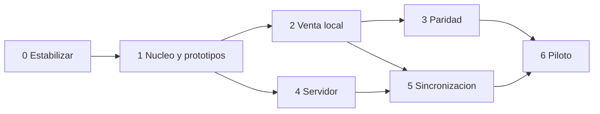

# 04 · Plan de migración por etapas

Fecha: 2026-09-24. [Índice](README.md). Alcance confirmado: Windows, Android y sincronización con operación offline.

## Estrategia

**Acuerdo confirmado por el usuario el 24-09-2026:** crear una aplicación MAUI nueva dentro del mismo repositorio y trasladar progresivamente la lógica existente, corrigiéndola y desacoplándola. La interfaz, API y sincronización se construyen nuevas; reglas, consultas y pruebas se reutilizan selectivamente. No realizar una refactorización general previa de WinForms. El punto de reanudación está en la [memoria de continuidad](CONTINUIDAD.md).

Mantener WinForms operativo mientras se extraen reglas y se construye MAUI en paralelo. Cada entrega debe demostrar un flujo completo con datos de prueba antes de reemplazar una función productiva. El piloto de una instalación incluye todas sus terminales operativas bajo el nuevo protocolo; no mezclar escritores WinForms/MAUI sobre el mismo stock sin un adaptador específico.

La corrección del legado y su migración son trabajos diferenciados. Primero se establece qué comportamiento es correcto; después se verifica que MAUI lo conserve. No convertir un test fallido actual en «comportamiento esperado» para facilitar paridad.

## Etapas y esfuerzo

Estimación de planificación, no presupuesto cerrado. Una semana-persona representa trabajo de ingeniería concentrado. Los rangos incluyen implementación y automatización técnica de cada etapa; acceso a usuarios, hardware, ambientes, revisión y contingencias pueden extender el calendario.

| Etapa | Entrega verificable | Dependencia | Esfuerzo orientativo |
|---|---|---|---:|
| 0 · Estabilización y decisiones | Base de referencia y políticas offline explícitas | Ninguna | 1–2 semanas-persona |
| 1 · Núcleo y pruebas de viabilidad | Bibliotecas desacopladas + prototipos Windows/Android/replicación | 0 | 2–4 |
| 2 · Venta local completa | Login, turno, catálogo, carrito y cobro MAUI con durabilidad | 1 | 3–5 |
| 3 · Paridad funcional | Todos los módulos y controles del legado adaptados | 2 | 4–6 |
| 4 · Servidor y contratos | Identidad, terminales, API, esquema central, inbox y cambios | 1 y modelo acordado en 0 | 5–8 |
| 5 · Sincronización offline | Cupos, push/pull, conflictos, recuperación y UI de estado | 2 y 4; se integra con 3 | 7–11 |
| 6 · Piloto y despliegue | Datos conciliados, hardware certificado, operación y reversión ensayadas | 3 y 5 | 3–5 |
| **Total** | **Paridad + funcionamiento distribuido offline** | | **25–41 semanas-persona** |

Agregar una reserva orientativa del 20–30% sitúa el esfuerzo alrededor de 30–54 semanas-persona. Dos desarrolladores con apoyo de QA/operación podrían planificar inicialmente unos 5–8 meses, ajustándolo tras la etapa 1; un solo desarrollador necesitaría un horizonte mayor. No dividir esfuerzo entre personas de forma lineal: hay dependencias, coordinación y pruebas de campo.

La etapa 4 puede avanzar mientras se completa la UI de etapa 3. La sincronización y los cupos son la mayor incertidumbre. iOS/macOS, DTE, nueva integración bancaria, clientes/fiado, exportación Excel/PDF y periféricos todavía no integrados no están incluidos en estas cifras.

## Etapa 0 · Referencia funcional y políticas

**Avance 01-10-2026:** corregida la doble resta de MIG-001 para nuevas devoluciones; 179 pruebas seleccionadas correctas. Se verificó bruto/neto por fecha y arqueo por turno. La conciliación del histórico, MIG-002, costos netos y restantes criterios de salida siguen pendientes. Detalle en [corrección de devoluciones](07-ETAPA-0-DEVOLUCIONES.md).

**Avance posterior, MIG-002:** implementados descuentos proporcionales, redondeo acumulado, rechazo de ítems repetidos y vista previa común. Suite seleccionada: 201 correctas; WinForms compila. Histórico inconsistente se bloquea para conciliación. Concurrencia, costos netos, H03 y restantes criterios siguen pendientes. Detalle en [descuentos e ítems repetidos](08-ETAPA-0-DESCUENTOS.md).

**Avance posterior, H16/parte de MIG-007:** implementados costo neto, utilidad/margen y rankings por fecha de devolución, con reparto común de descuentos. Suite seleccionada: 212 correctas; WinForms compila. No completa los otros asuntos de MIG-007 ni la etapa 0. Próximo trabajo: caracterizar H03/MIG-004. [Reglas, evidencia y límites](09-ETAPA-0-COSTOS-Y-REPORTES.md).

**Trabajo:** registrar baseline actual; resolver H01 y caracterizar H02/H03 con pruebas; revisar importes, costos y arqueo; inventariar volúmenes, equipos, lectores, resoluciones, duración de cortes y Windows reales. Acordar cupos versus sobreventa, permiso offline, devoluciones, rol de apertura de caja y ubicación del servidor.

**Entregables:** matriz de reglas y permisos, dataset anonimizado representativo, catálogo de hardware, test de devolución corregido, registro de decisiones y reporte de diferencias contables del histórico. Las correcciones se entregan por cambios pequeños revisables en el legado.

**Salida:** suite seleccionada sin fallos; cada diferencia financiera explicada; alcance offline aceptado. Las pruebas SQL Server se ejecutan solo en una base desechable identificada. Un operador valida los escenarios de venta/arqueo/devolución.

**Reversión:** versión WinForms previa y backup consistente anterior a cualquier corrección de datos. No restaurar sin conciliar ventas posteriores.

## Etapa 1 · Extraer núcleo y resolver riesgos técnicos

**Preparación al 01-10-2026:** se corrigió H03 local con auditoría transaccional y avisos aislados; 215 pruebas seleccionadas correctas y WinForms compilado. Se recomienda adelantar el inicio técnico de esta etapa sin ampliar las reparaciones generales de WinForms. La dependencia formal de cierre de etapa 0 conserva sus pendientes de histórico, operador y decisiones; no habilita producción. La identidad persistente/idempotencia completa de MIG-004 sigue en etapas 1–2. [Detalle](10-ETAPA-0-CONFIRMACION-VENTA.md).

**Trabajo:** extraer `Dinero`, `Impuestos`, reglas de carrito y contratos; inyectar dependencias en servicios; separar `Sesion`, configuración, reloj y notificación. Implementar adaptadores legacy para mantener WinForms compilando. Crear solución MAUI mínima y fijar SDK/workloads/paquetes reproducibles.

**Prototipos obligatorios:** SQLite nativo en Release Android arm64 y Windows x64, CRUD/transacción/backup, lector HID real, suspensión y relanzamiento con borrador, y dos réplicas con una operación duplicada hacia un servidor mínimo. Este último prueba que el diseño cabe técnicamente antes de invertir en todas las pantallas.

**Entregables:** bibliotecas núcleo, tests puros sin base de datos, adaptadores, registro de versiones y resultados medidos. Prototipos aislados de datos de producción.

**Salida:** no hay referencia de Domain/Application a WinForms/MAUI/SQL; WinForms mantiene el flujo actual; los dos destinos ejecutan la transacción local y recuperan un resultado tras reinicio. La operación reenviada al prototipo solo tiene un efecto.

**Reversión:** WinForms continúa usando su adaptador. No se migra aún ninguna instalación productiva. Si SQLite/periférico no funciona en Release, revisar elección antes de seguir.

## Etapa 2 · Una venta MAUI de extremo a extremo

**Trabajo:** login, cambio obligatorio, navegación, productos de consulta, abrir turno, escanear/buscar, múltiples carritos, descuento, pagos simples/mixtos y arqueo básico. Confirmación local con OperationId, auditoría/outbox en la misma transacción y borradores duraderos. Aplicar el modelo de terminal/turno desde el comienzo.

**Entregables:** ejecutable Windows y APK de prueba; ViewModels comprobables; migraciones locales; interfaz adaptable a teléfono/tablet y escritorio. En esta etapa el outbox puede permanecer pendiente en laboratorio; no se anuncia sincronización productiva terminada.

**Salida:** un cajero completa apertura–venta–cierre; cantidades por kg, descuento total, vuelto y doble toque correctos; cerrar proceso después del commit conserva venta y un único OperationId. No bloquea UI durante acceso local.

**Reversión:** laboratorio o circuito de aceptación separado. Si se hace prueba de campo con operaciones reales, requiere stock/caja aislados y conciliación explícita antes de volver al legado.

## Etapa 3 · Paridad de módulos

**Trabajo:** catálogo/categorías, importación por stream, costos/márgenes, usuarios, permisos, dashboard, reportes, detalle, devolución/anulación, historial de caja, backup/exportación y auditoría. Sacar de las vistas toda regla sensible. Mantener devoluciones en efectivo y límites del reembolso.

**Entregables:** matriz de trazabilidad de los 17 formularios al conjunto de páginas/diálogos/ViewModels y casos de uso; todas las historias actuales demostrables; manual operativo Windows/Android y pruebas de paridad sobre el dataset corregido.

**Salida:** fórmulas coinciden con el oráculo de etapa 0, cada caso de uso rechaza roles incorrectos, listados grandes mantienen interacción fluida, backup se restaura en un ambiente de aceptación.

**Reversión:** no activar módulos incompletos en producción; conservar versiones de app y datos del laboratorio para reproducir diferencias. Los cambios de datos no se revierten desinstalando la app.

## Etapa 4 · Servidor y modelo de tienda

**Trabajo:** API ASP.NET Core, contratos OpenAPI v1, identidad y enrolamiento, SQL Server detrás del servidor, turnos por terminal, operaciones identificadas, inbox transaccional, cambios ordenados, snapshots consistentes, catálogo versionado y administración de cupos. Separar autorización online de permiso offline firmado.

**Entregables:** servicio desplegable en staging, migraciones centrales exclusivas, pipeline de pruebas SQL real aislado, certificados/secretos gestionados, métricas, backup central y cliente de integración.

**Salida:** peticiones de otra tienda/terminal no atraviesan el aislamiento; repetir operación devuelve el mismo resultado; concurrencia sobre última unidad/cupo, devolución y cierre conserva invariantes; caída después del commit responde correctamente al retry.

**Reversión:** mantener API/esquema compatibles durante despliegues; backup antes de migración. Aplicar esquema expansivo antes de clientes, sin quitar campos usados por la versión anterior. No conectar el legacy directamente a las nuevas tablas operativas.

## Etapa 5 · Integración offline y convergencia

**Trabajo:** push/pull con cursores, colas persistentes, dependencias de turno/venta/devolución, cupos exclusivos, eco de operaciones propias, tombstones, expiración/renovación, revisión de inconsistencias, cierre provisional y recuperación tras reinstalación. Sincronización al iniciar/reanudar y manual; trabajo Android en segundo plano como complemento.

**Entregables:** pruebas automatizadas con dos bases locales reales y API/SQL Server, simulación de pérdida/duplicación/desorden, pantalla de estado comprensible y herramientas administrativas de conciliación.

**Salida:** escenarios T13–T23 y T31 de [validación](05-VALIDACION-Y-OPERACION.md) aprobados; sin ventas desaparecidas ni duplicadas; stock/cupos conciliados después de cortes; no se libera stock de un dispositivo perdido sin resolver su estado. Los terminales muestran la antigüedad del consolidado.

**Reversión:** detener emisión y nuevas operaciones mediante modo de mantenimiento conservando cada outbox; no borrar pendientes ni volver a una copia local anterior. Reanudar con versión compatible o aplicar recuperación controlada.

## Etapa 6 · Migración y piloto

**Trabajo:** ensayo de importación sobre copia de una instalación, conciliación, formación, prueba física de dispositivos, instalación firmada, ventana de corte, migración final y acompañamiento. Pilotar primero una instalación; ampliar cuando sus turnos cierren sin diferencias inexplicadas.

**Entregables:** acta de conciliación, paquete/versiones firmados, mapa de IDs, log de importación, backups verificados, manual de recuperación y registro de incidencias del piloto.

**Salida propuesta:** al menos 10 turnos completos y 2 cortes de conectividad ensayados, incluyendo Windows y Android; cero diferencias de dinero sin explicar, cero ventas duplicadas/perdidas en las pruebas, cola sin atascos y restauración demostrada. Negocio/TI ajustan la duración según uso real.

**Reversión antes de la primera venta MAUI:** desactivar nuevo sistema y reabrir legacy desde snapshot final comprobado, sin escritores simultáneos.

**Reversión después de ventas MAUI:** detener nuevas ventas, exportar y conciliar todas las operaciones centrales y pendientes, preservar evidencia y recuperar mediante versión compatible o herramienta de conversión validada. Restaurar simplemente `pos.db` viejo perdería ventas: no es un rollback válido. Favorecer corrección hacia adelante si no existe conversión inversa ensayada.

## Backlog inicial priorizado

| Trabajo | Origen | Criterio verificable | Etapa |
|---|---|---|---|
| MIG-001 Corregir reporte de devolución e histórico | H01/H16 | Venta 3000/devolución 2000 da bruto 3000/neto 1000; conciliación por fecha | 0 |
| MIG-002 Reembolso con descuentos e ítems duplicados | H02 | Nunca supera lo cobrado ni devuelve cantidad repetida | 0 |
| MIG-003 Contexto de usuario/terminal y puertos | H08/H09 | Tests de dos sesiones no comparten datos | 1 |
| MIG-004 Confirmación idempotente y atómica | H03/H05 | Fallo de auditoría/UI o respuesta perdida no duplica venta | 1–2 |
| MIG-005 Turno por terminal y aprobación de faltante | H04/H06 | Un turno abierto por terminal; cierre validado sin usar formulario | 2 |
| MIG-006 SQLite/archivos/periféricos portables | H11/H12 | Release real, backup/restauración y lector probados | 1–3 |
| MIG-007 Dinero, CSV y consultas financieras | H10/H15/H16 | Importes exactos, cultura definida, costos y devoluciones conciliados | 0–3 |
| MIG-008 API, inbox, versiones y migración central | H07/H13/H14 | Tests de operación duplicada, migración antigua y permisos | 4 |
| MIG-009 Cupos y protocolo de réplica | Nuevo requisito offline | Dos terminales desconectados no consumen la misma asignación | 4–5 |
| MIG-010 Recuperación y piloto | Nuevo requisito distribuido | Backup antiguo no duplica operaciones ni cupos | 5–6 |

## Riesgos de planificación y responsables

| Riesgo | Señal temprana / mitigación | Responsable funcional |
|---|---|---|
| Datos legacy inconsistentes | Conciliar muestra real en etapa 0, no al final | Desarrollo + dueño/encargado |
| Cupos imprácticos para la operación | Simular día de venta y cortes con catálogo real | Dueño + desarrollo |
| SDK/periférico Android incompatible | Probar modelo físico en etapa 1 | Desarrollo + TI |
| Falta de pruebas sobre SQL Server antiguo | Fixtures de migraciones y entorno desechable | Desarrollo/QA |
| Dispositivo perdido con ventas pendientes | Backup/exportación, cupos retenidos y procedimiento de conciliación | Operación + TI |
| Ciclo de MAUI más corto que el proyecto | Revisar soporte por hito e incluir actualización planificada | Responsable técnico |
| Historial demasiado grande para móviles | Volumen/retención por terminal y paginación medidos | Desarrollo + negocio |

La documentación existente expresa que se debe evitar complejidad innecesaria. La propuesta mantiene ese criterio: añade servidor, identidad, idempotencia y colas porque el alcance offline compartido los requiere; pospone capacidades sin demanda confirmada.
